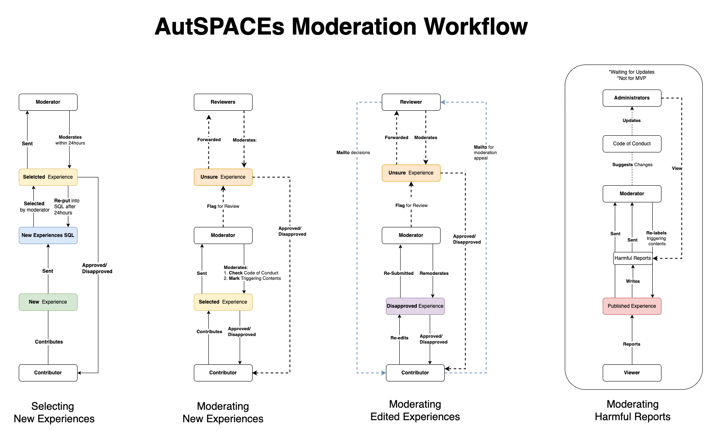

# Meet-Up Discussion on November 25 2021

The discussed strategies are drawn from discussion in the meet-up on November 30 2021. Documented Notes can be found on issue [#593](https://github.com/alan-turing-institute/AutisticaCitizenScience/issues/593)

## Related Material
* Moderation Workflow Diagram-December 02 2021 

* [Click for detail of the workflow diagram](https://viewer.diagrams.net/?tags=%7B%7D&highlight=0000ff&edit=_blank&layers=1&nav=1&page-id=2EoajS9YyuE2mbzpoMci&title=user_flow_autspacs.drawio#Uhttps%3A%2F%2Fdrive.google.com%2Fuc%3Fid%3D1pohsA28S36n1yIWvAJhNd5k79qazjSeg%26export%3Ddownload)

## Discussed strategies are as followed:
* Harmful reports will be sent to moderators. Administrators will have the access to view all the harmful reports, but will not receive the notifications per experience.
* We will focus on the first workflows: **New Experiences** and **Disapproved Experiences**.
* We will hold off the "flag for harmful reports" feature for MVP as it will complicate the current infrastructure. Apart from that, further clarity will be needed for the "harmful reports" process. 
* Email should be avoided to use as the means of the communication in the platform as it is not user-friendly and can be quite hard to document.
* Moderators will select experiences on their own for moderation. Once experiences are selected, moderators should moderate them within 24 hours. Otherwise, the experiences will be put back into the pool and wait for moderation.
* The role of "administrators/reviewers" need to be further discussed, as the "flag for help" feature will add workload for the development side. 

