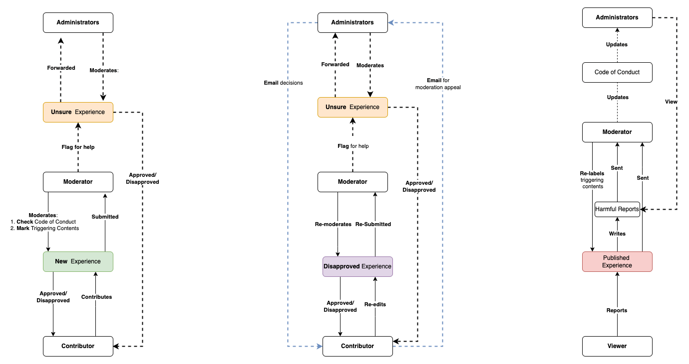

Meet-Up Discussion on November 25 2021
The discussed strategies are drawn from discussion in the meet-up on November 30 2021. Documented Notes can be found on issue [#593](https://github.com/alan-turing-institute/AutisticaCitizenScience/issues/593)

## Related Link
Moderation Workflow Diagram-November 29 2021 

* [Moderation Workflow Diagram-November 29 2021](https://viewer.diagrams.net/?tags=%7B%7D&highlight=0000ff&edit=_blank&layers=1&nav=1&page-id=2EoajS9YyuE2mbzpoMci&title=user_flow_autspacs.drawio#Uhttps%3A%2F%2Fdrive.google.com%2Fuc%3Fid%3D1pohsA28S36n1yIWvAJhNd5k79qazjSeg%26export%3Ddownload)
## Discussed strategies are as followed:
* We will hold off the "flag for harmful reports" feature for MVP as it will complicate the current infrastructure. Apart from that, further clarity will be needed for the "harmful reports"  process. 
