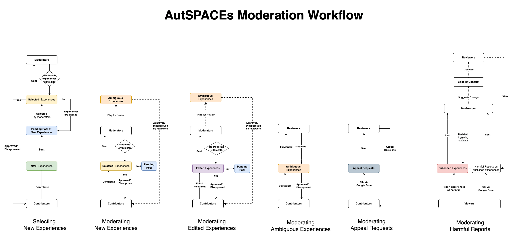

# Strategy Process for Moderation
This folder holds information and discussions about how the moderators will interact with the platform:
- this informs what features need to be built
- how decisions were made


## Moderation Workflow 2021-12-09
This is the most up-to-date moderation workflow for MVP. Updates for the moderation workflow can be changed on [the diagram](https://viewer.diagrams.net/?tags=%7B%7D&highlight=0000ff&edit=_blank&layers=1&nav=1&page-id=JlZQS5yWHLnshq0prFdP&title=user_flow_autspacs.drawio#Uhttps%3A%2F%2Fdrive.google.com%2Fuc%3Fid%3D1pohsA28S36n1yIWvAJhNd5k79qazjSeg%26export%3Ddownload)

## Contents of strategy process discussion for moderation folder:
* [30 November 2021](20211130_summary-30-November-2021.md)
* [25 November 2021](20211125_summary-25-November-2021.md)

## Diagram of moderation workflow 
* [02 December Moderation Diagram](moderation_workflow_diagram_20211202.png)
* [29 November Moderation Diagram](moderation_workflow_diagram_20211129.png)
