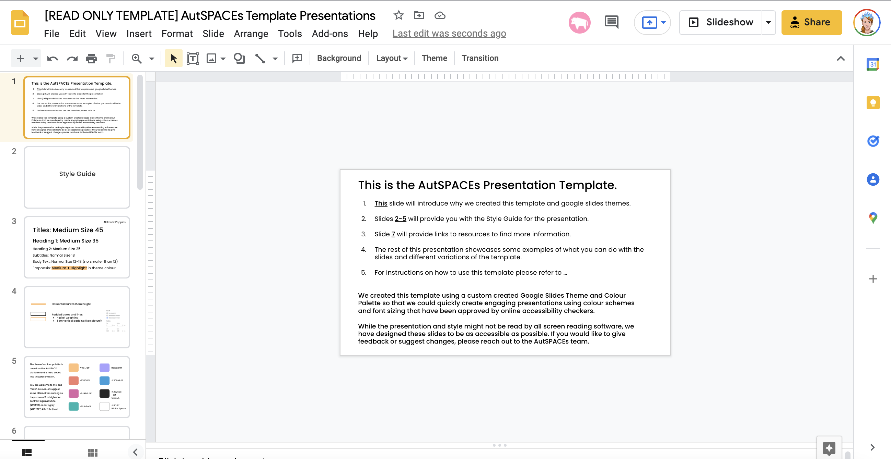
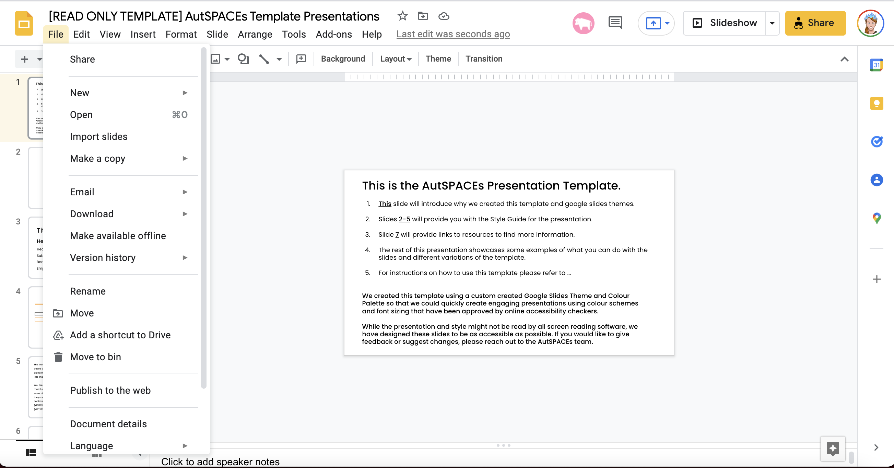
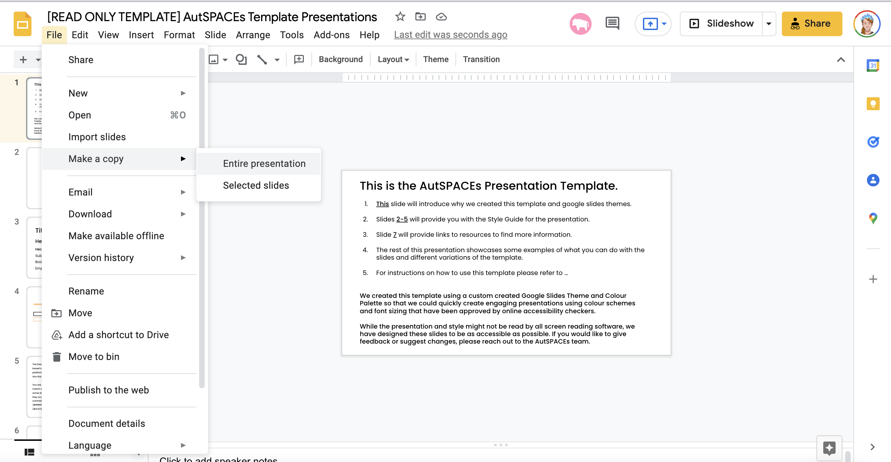
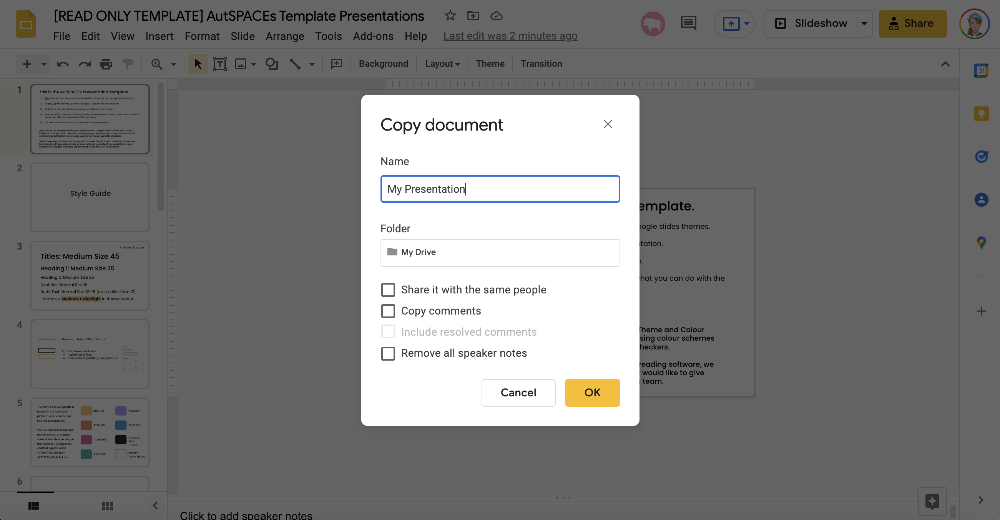
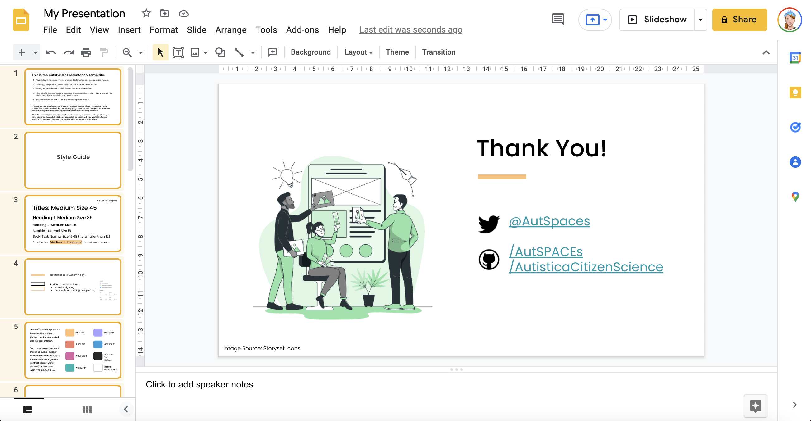
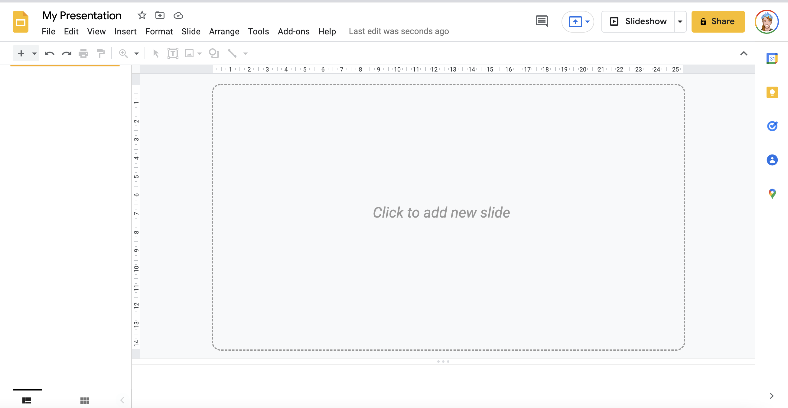
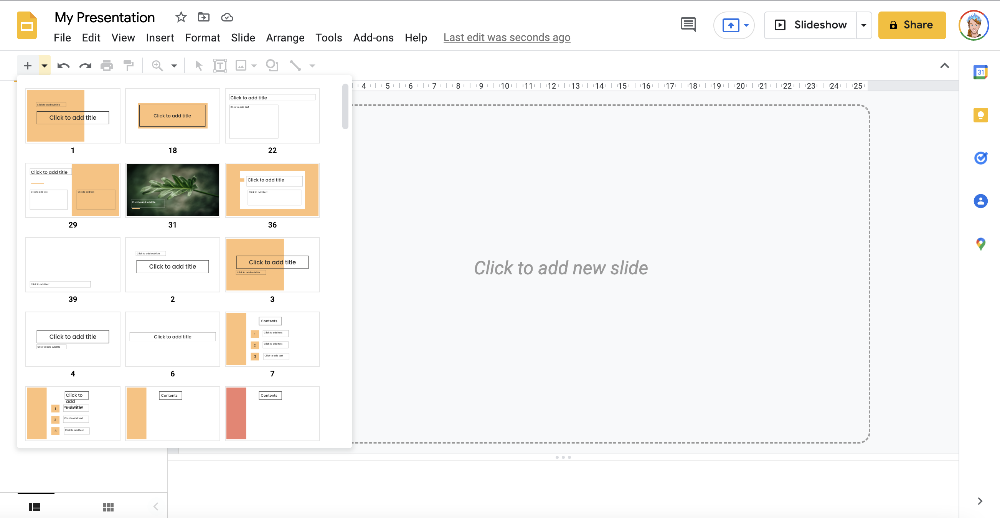
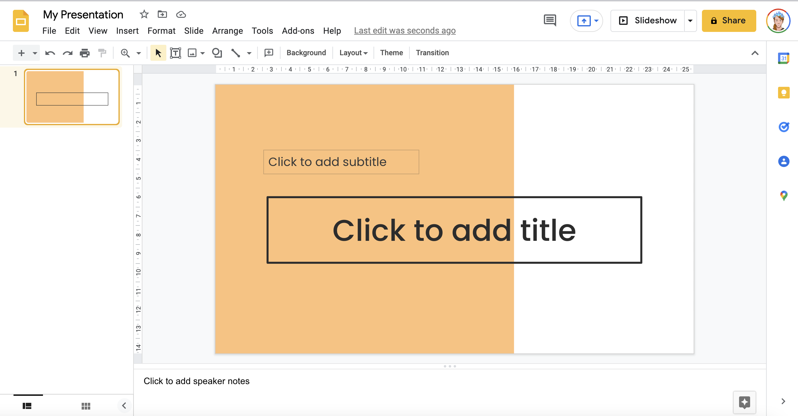

# Guide for How to use the Google Slides Presentation Template 

The AutSPACEs team has created a template theme and colour palette on Google Slides which makes it easier to create presentations and reuse presentation slides across the community. These slides are available at this google drive link [here](https://docs.google.com/presentation/d/1gf2IKr9W-BBR-lxI-Gf8P6c15zirIn8nAO0rAZNGX58/edit?usp=sharing), and can also be viewed in pdf form [here](https://github.com/alan-turing-institute/AutisticaCitizenScience/blob/master/platform-designs/design-resources/Google-Slides-Presentation-Template.pdf).

This guide provides instructions on how to create a copy of the template so that you can use the theme in future presentations. 

### Attribution
If you use this template or the slides design, please remember to acknowledge the AutSPACEs community according to the CC-BY license by acknowledging the **Autistica/Turing Citizen Science Community** and, where practical, linking to https://github.com/alan-turing-institute/AutisticaCitizenScience. You can find more details on how AutSPACEs uses the CC-BY license [here.](https://github.com/alan-turing-institute/AutisticaCitizenScience/blob/master/.github/LICENSE.md)

### Getting Help
If you are unable to follow the steps below or any of the links we have provided are broken: please open an Issue on GitHub (instructions for how to do that are [here]() or reach out to one of the community members and ask for help). 

## Get Started 
You will need a working Google Drive account and be logged in in order to use the template slides. 

1. Open the Google Slides Presentation Template located [here](https://docs.google.com/presentation/d/1gf2IKr9W-BBR-lxI-Gf8P6c15zirIn8nAO0rAZNGX58/edit?usp=sharing).
2. Create a copy of the Presentation and rename it.
3. Select all the example slides from the existing presentation and delete them (don't worry, we'll add new ones in next). 
4. From the drop down menu, select which slides you would like to add to your new presentation. 
5. Create! 

## Step 1
* Open the Google Slides Presentation Template located [here](https://docs.google.com/presentation/d/1gf2IKr9W-BBR-lxI-Gf8P6c15zirIn8nAO0rAZNGX58/edit?usp=sharing).

## Step 2
* Select "Make a Copy" and "Entire Presentation" from the File dropdown menu

* Rename your new presentation.  

## Step 3
* Select all the existing slides in the template presentation (shown in the lefthand "view" panel)...and delete them. You will now have an empty presentation.

## Step 4
* Click on the **+** button to bring up all the slide designs you can choose from in this template. 

## Step 5
* Add whichever slides you'd like to your new presentation and have fun creating a new presentation!

