# Questions for the community

This file contains questions for the wider community on the wireframes that have been developed.

**Small Glossary of terms:**

Github is a tool where people build software  
Sprint is a short, time-boxed period of work  
Wireframe  is a layout of a web page that demonstrates what elements will exist on key pages  

## Feedback Options – Public & Private

* Public Feedback:

Community to access Google Forms to provide feedback: 
https://bit.ly/AutisticaTuringCitSciForm

Copy and paste the questions from Github Sprint page and add answers into the Google form if you are comfortable making them public. 

* Private Feedback 

Please email the questions and answers to either or both Georgia Aitkenhead at gaitkenhead@turing.ac.uk or Chris Legg at christopher.legg@fujitsu.com.

### Sprint 1
Community Wireframe Feedback Questions 

**Sprint 1** 
Focuses on core User Interface features for a Minimum Viable Product
Gather community feedback to feedback into User Experience Life Cycle to support design decisions.

**Sprint 1 Goal: Creation of first platform wireframe design**

**Sprint 1 Demo Video: https://youtu.be/4f6kn5HLysc**

Time codes and images have, been added in reference to the questions. 

#

### **Sprint 1, Demo Video Community UX Feedback Questions** 

**Home Page**

**Q1. How relevant is the strap Line (easily remembered phrase used by an organization so that people will recognize it or its products) “creating better environments” to the project, do you feel it adds any real value?** 

**Time Stamp: 4:58 https://youtu.be/4f6kn5HLysc?t=4m58s**

**Image**
 

**One word answer:**

**Expanded answer:**

**Any other comments:**

#

**Q2. Do the stated aims clearly represent the aims of the project?** 

**Time Stamp: 4:58 https://youtu.be/4f6kn5HLysc?t=4m58s**

**Image:**
 

**One word answer:**

**Expanded answer:**

**Any other comments:**

#

**Q3. Is the design with the Core Three Project Panels, simple enough for the user? Is it clear?**

**Time Stamp: 4:58 https://youtu.be/4f6kn5HLysc?t=4m58s**

**Image:** 
 

**One word answer:**

**Expanded answer:**

**Any other comments:**

#

**Q4. Is the color theme, call to actions (buttons) and header all clear, consistent and working well together, which to you prefer the design to the left or the design to the right?**

**Time Stamp: 2:18 https://youtu.be/4f6kn5HLysc?t=2m18s**

**Image:**
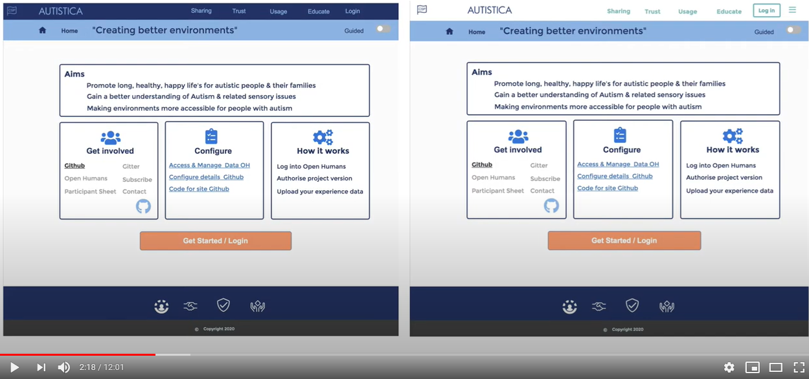 

**One word answer:**

**Expanded answer:**

**Any other comments:**

#

**Q5. Do you feel the full version or paired down secure engagement blue band with icons is effective, in indicating, the platform is safe and secure to the user, does it achieve this in both instances or does it just add another layer of complexity?**

**Time Stamp: 
Full = 0:29 https://youtu.be/4f6kn5HLysc?t=0m29s 
Paired Down = 8:56 https://youtu.be/4f6kn5HLysc?t=8m56s 
Shown Together 0:49 https://youtu.be/4f6kn5HLysc?t=0m49s **

**Images:**
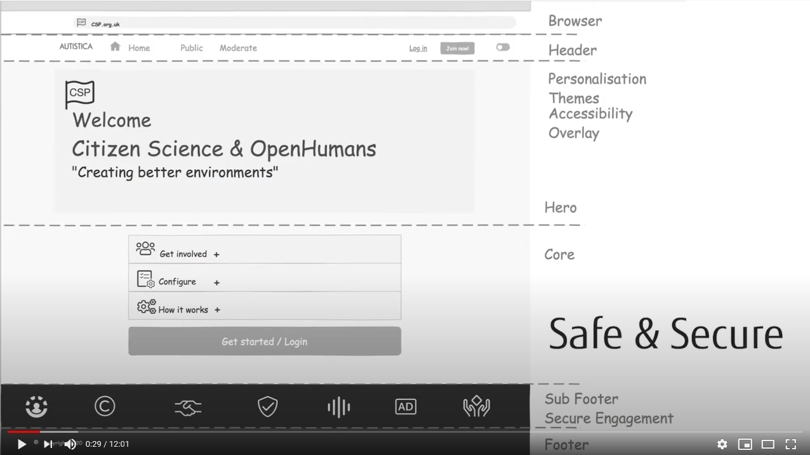 
 
 
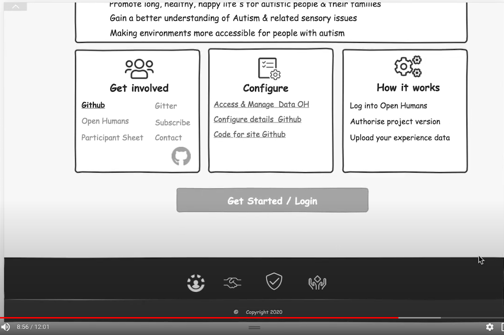 
 
 
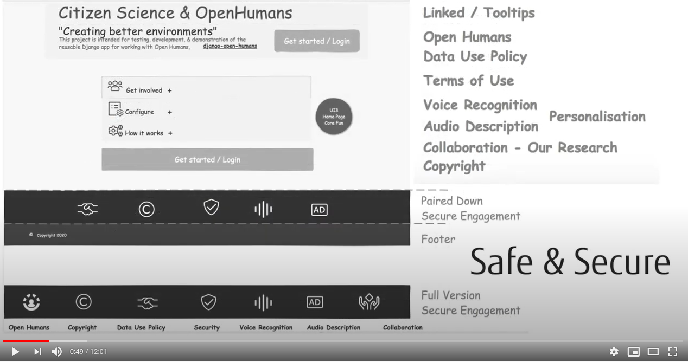 

**One word answer:**

**Expanded answer:**

**Any other comments:**

#

**Q6. Do you feel the addition of a digital subscription – newsletter would be useful for members to receive further information about the project?** 

**Time Stamp:NA**

**Image:NA**

**One word answer:**

**Expanded answer:**

**Any other comments:**

#

**Q7. Do you have any further feedback around the home page?**

**Time Stamp: 2:18 https://youtu.be/4f6kn5HLysc?t=2m18s**

**Image:** 
 

**One word answer:**

**Expanded answer:**

**Any other comments:**

#

**Experience Page**

**Q8. Is text box framing being, used effectively to add clarity to the experience content areas?**

**Time Stamp: 2:26 https://youtu.be/4f6kn5HLysc?t=2m26s**

**Image:** 
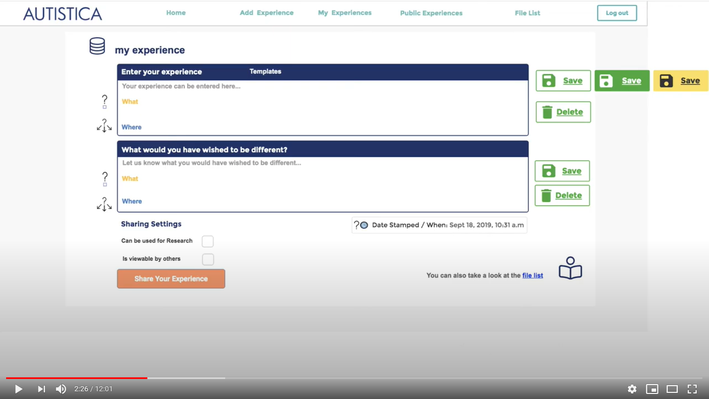 

**One word answer:**

**Expanded answer:**

**Any other comments:**

#

**Q9. Do you feel the use of navigation steppers provides an effective tool in mapping the user journey?**

**Time Stamp: 7:47 https://youtu.be/4f6kn5HLysc?t=7m47s**

**Image:**
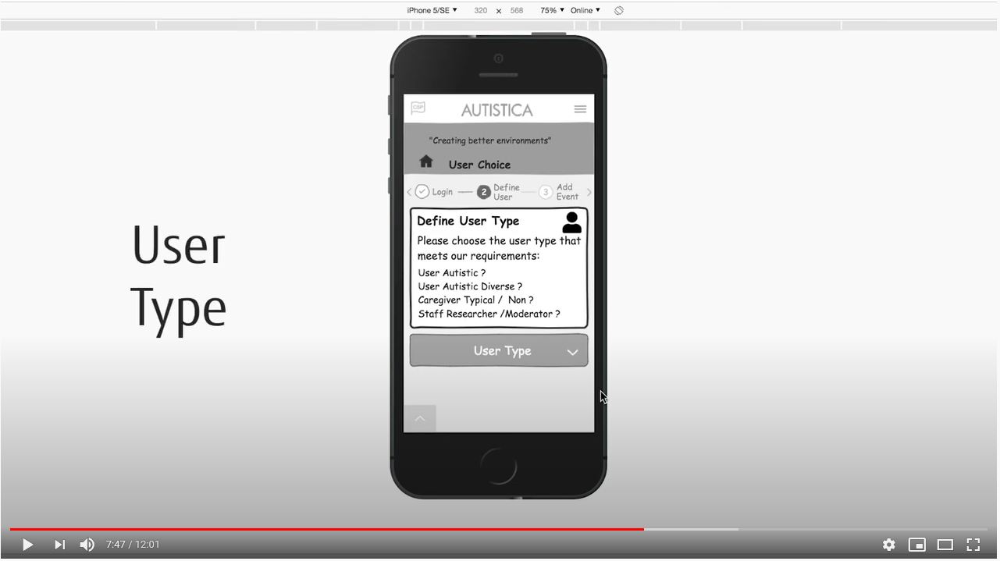 

**One word answer:**

**Expanded answer:**

**Any other comments:**

#

**Q10. Experience search, how might you search for experiences? 
Perhaps search categories might include by ID No, Date, Experience Grouping, location and keyword. Can you suggest anything else you feel you should be able to search by?**

**Time Stamp: 11:47 https://youtu.be/4f6kn5HLysc?t=11m47s**

**Image:**
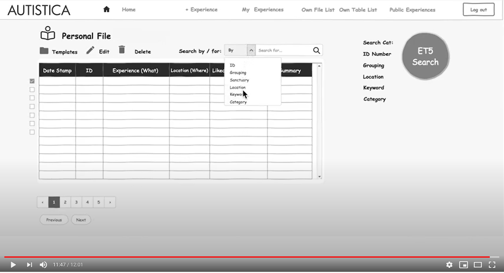 

**One word answer:**

**Expanded answer:**

**Any other comments:**

#

**Q11. Do you prefer a Search Function by / for (ordered key filters) option over, a Persistent Search (search query, which remains active after the results are returned)?**

**Time Stamp: 
by/for 11:47  https://youtu.be/4f6kn5HLysc?t=11m47s 
Persistent 11:24 https://youtu.be/4f6kn5HLysc?t=11m24s**

**Image:**

 
 
 
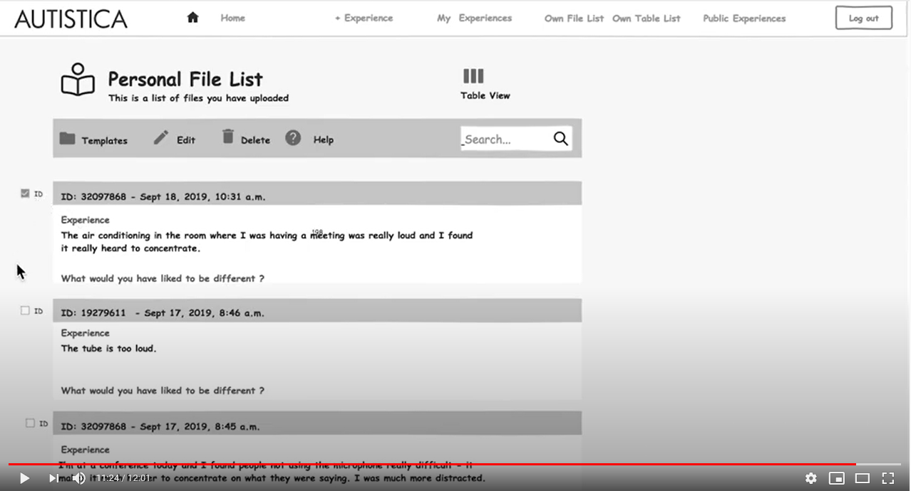 

**One word answer:**

**Expanded answer:**

**Any other comments:**

#

**Q12. Any further feedback around the add experience pages?**

**Time Stamp: 11:04 https://youtu.be/4f6kn5HLysc?t=11m04s**

**Image:**
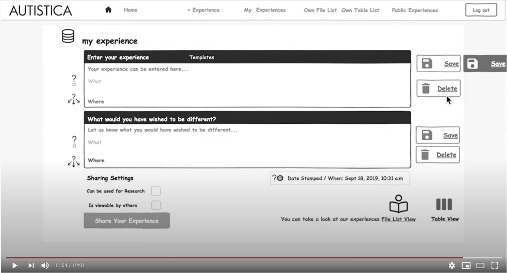 

**One word answer:**

**Expanded answer:**

**Any other comments:**

#

**Define User Type**

**Q13. Define User Type does this page work for you? Is it clear enough, are the terms being used, correct for the community – User / Profile?**

**Time Stamp: 7:53 https://youtu.be/4f6kn5HLysc?t=7m53s**

**Image:** 
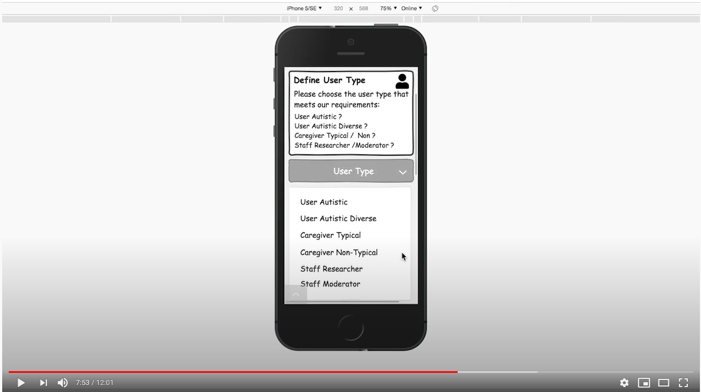 

**One word answer:**

**Expanded answer:**

**Any other comments:**

#

## Sprint 2

**Sprint Goal:Project processes documentation and Github issues tidy up**

**Sprint 2 Demo Video: https://youtu.be/A_6uOwFZRfo**

**Sprint 2 Community Engagement & Documentation Updates**

Closed issues, progressed, opened, challenges and blockers
Questions focus on the content within the video and engaging with the community further.

**Q1. How can we engage with the community more effectively in general?**

**Time Stamp:** NA 
**Images:** NA 

**One word answer:**

**Expanded answer:**

**Any other comments:**

#

**Q2. How effective are the wireframes / videos currently in demonstrating a proposed user journey?**

**Time Stamp:** NA 
**Images:** NA

**One word answer:**

**Expanded answer:**

**Any other comments:**

#

**Q3. Would you like to access project management content and report for the project, or get involved more - share a skill etc?**

**Time Stamp:** NA 
**Images:** NA 

**One word answer:**

**Expanded answer:**

**Any other comments:**

#

**Q4. Have you got, any expertise / interests that you could bring to the project, that could benefit the project - coding, design, user testing - have you got an interest in being actively involved in any of these areas, if so please let us know.**

**Time Stamp:** NA 
**Images:** NA 

**One word answer:**

**Expanded answer:**

**Any other comments:**

#

**Q5. Can you think of any user stories, which would aid the platform, would make, useful additions to the platform?**

(user story is an informal, natural language description of one or more features of a software system.)

**Time Stamp:** NA 
**Images:** NA 

**One word answer:**

**Expanded answer:**

**Any other comments:**

#

**Q6. How could the Sprint videos be improved, to benefit the wider community in terms of the review and feedback process?**

**Time Stamp:** NA 
**Images:** NA

**One word answer:**

**Expanded answer:**

**Any other comments:**

#

**Q7. Would you be interested in reviewing the full Sprint Report? 
Which can be access via urls in the video at the end. Have you got any thoughts, feedback about these reports?**

**Time Stamp:** NA 
**Images:** NA 

**One word answer:**

**Expanded answer:**

**Any other comments:**

#

**Q8. Are you interested in becoming github collaborator to the project?**

**Time Stamp:** NA 
**Images:** NA 

**One word answer:**

**Expanded answer:**

**Any other comments:**

#

**Q9. Would you be interested in taking part in a 1:1 user testing session?** 

**Time Stamp:** NA 
**Images:** NA 

**One word answer:**

**Expanded answer:**

**Any other comments:**

#

**Q10. Would you be interested in attending a wireframe co-create workshop to help refine the wireframes further and share your inputs further?**

**Time Stamp:** NA 
**Images:** NA 

**One word answer:**

**Expanded answer:**

**Any other comments:**

#

**Q11. Would you be interested in being involved in the design process moving forward and make a further contribution?**

**Time Stamp:** NA 
**Images:** NA 

**One word answer:**

**Expanded answer:**

**Any other comments:**

#

**Q12. What do you feel the platform requirements could / should cover?**

**Time Stamp:** NA 
**Images:** NA 

**One word answer:**

**Expanded answer:**

**Any other comments:**

#

**Q13. From the Sprint 2 Demo Video it is clear where the community can access videos and reports from the Sprint?**

**Time Stamp:** NA 
**Images:** NA 

**One word answer:**

**Expanded answer:**

**Any other comments:**

#

**Q14. One of are challenges for the Sprint was gaining community feedback on the wireframes from Sprint 1 and moving forward. Do you feel the steps outlined from email – Community Wireframe Feedback Github Page – Google Form - we have taken to engage you are effective, if not how could the engagement be improved? (given, the ethical project restrictions)**

**Time Stamp:** NA 
**Images:** NA 

**One word answer:**

**Expanded answer:**

**Any other comments:**

#

## Sprint 3

**Sprint 03 Goal: On boarding of project development team and clarification of community feedback process**

**Sprint 03 = https://youtu.be/IG-Vq8m8ELA**

**Sprint 3 Question**

**Q0. Which kinds of devices would the platform need to support e.g. android, iOS, Web?**

**Time Stamp:** NA 
**Image:** NA

**One word answer:**

**Expanded answer:**

**Any other comments:**

#

**Q1. What would you like the platform url / http to be?**

For example 
CSP.org.uk, AutisticaCitizenScience.org.uk, AutisticaCS.org.uk or something else?
 
(URL, Uniform Resource Locator, commonly used to reference web
pages (http) - the address of a web page)
 

**Time Stamp: 0:56 https://youtu.be/IG-Vq8m8ELA?t=0m56s** 

**Image:** 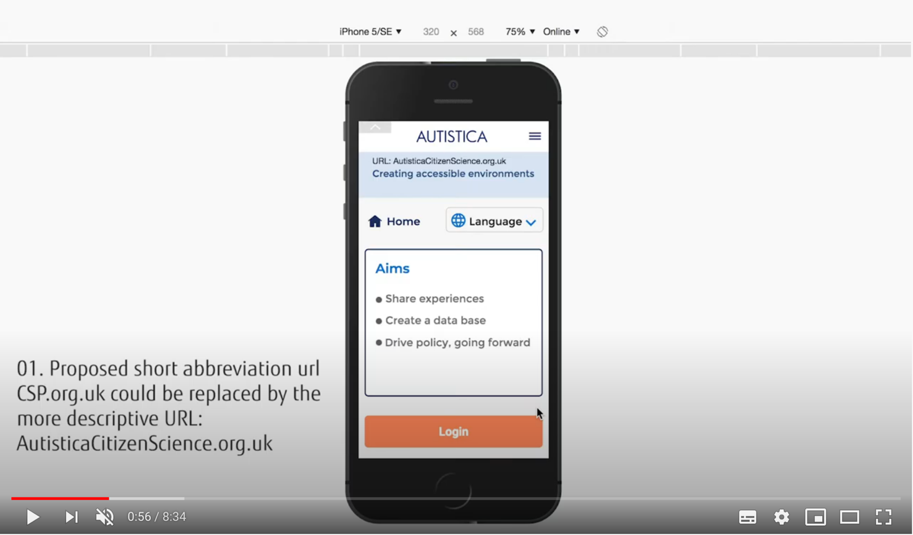 

**One word answer:**

**Expanded answer:**

**Any other comments:**

#

**Q2. Have you got, any suggestions what the platforms strap line could be currently altered from "Creating better environments" to Creating accessible environments?** 

**Time Stamp: 1:02 https://youtu.be/IG-Vq8m8ELA?t=1m02s** 

**Image:**
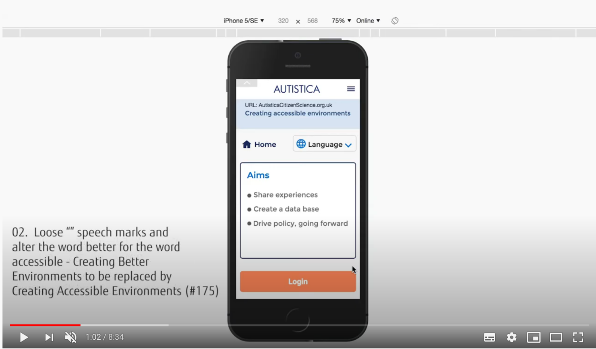 

**One word answer:**

**Expanded answer:**
**Any other comments:**

#

**Q3. Project aims where refined and shortened, which do you prefer, the long aims or the shorter aims, can you suggest any?**

**Time Stamp: 
1:15  https://youtu.be/IG-Vq8m8ELA?t=1m15s Sprint 3** 
 
**6:39 https://youtu.be/4f6kn5HLysc?t=6m39s Sprint 1** 

**Image:** 
![Image description]
(../../images/FujitsuAgile/sprint-questions-images/Sprint03_Q3.png) 

**One word answer:**

**Expanded answer:**

**Any other comments:**

#

**Q4. Does the reordering of the three panels made the flow more logical for the user?**
 
**Time Stamp:**
 
**1:16- 1:21 https://youtu.be/IG-Vq8m8ELA?t=1m15s Sprint 3** 
 
**4:33 https://youtu.be/4f6kn5HLysc?t=7m53s Sprint 1** 

**Images:** 
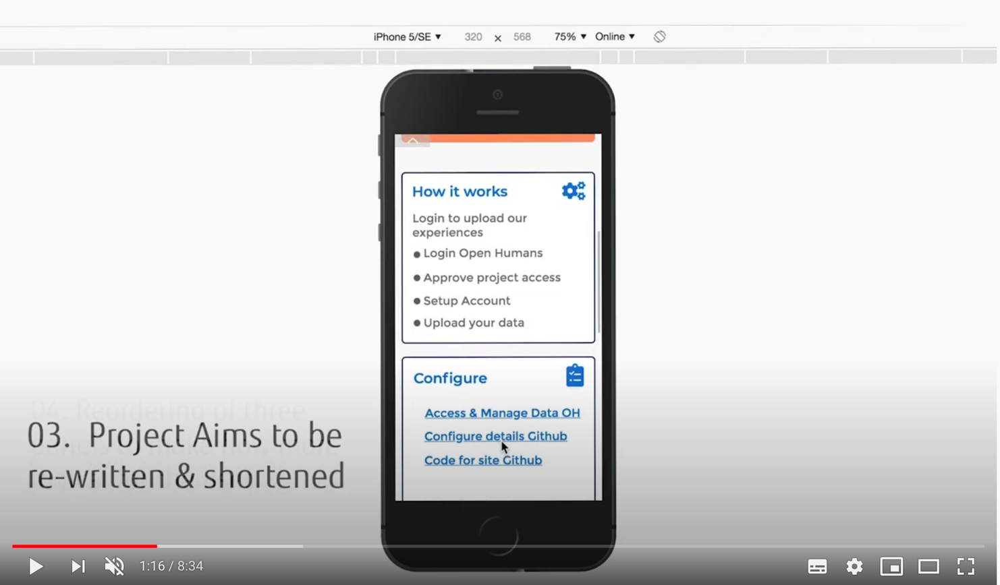 
 
 
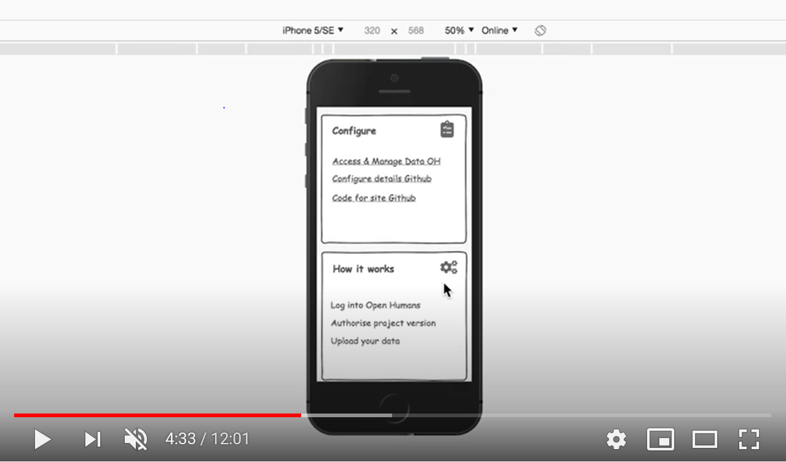 

**One word answer:**

**Expanded answer:**

**Any other comments:**

#

**Q5. Is the content in the three panels now clear and simplified enough for the user to follow?**
 
**Time Stamp: 1:27 https://youtu.be/IG-Vq8m8ELA?t=1m27s** 

**Image:** 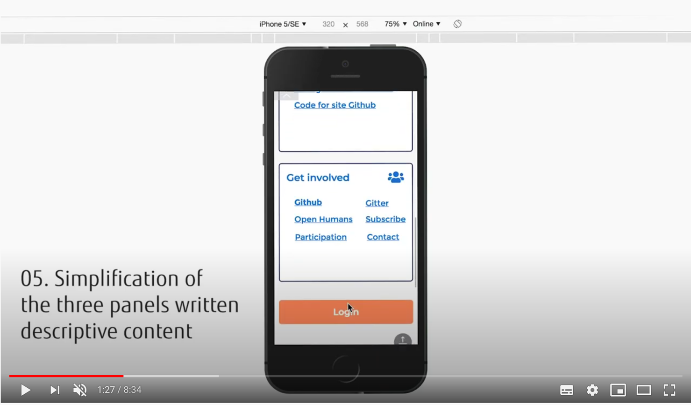 

**One word answer:**

**Expanded answer:**

**Any other comments:**

#

**Q6. User feedback sessions suggested that the addition of a digital newsletter subscription would be a useful component to provide login and general information about the project – i.e. provide a road map about the project so that the user can return. Do you feel this is a useful component?**

**Time Stamp: 1:31 https://youtu.be/IG-Vq8m8ELA?t=1m31s** 

**Image:** 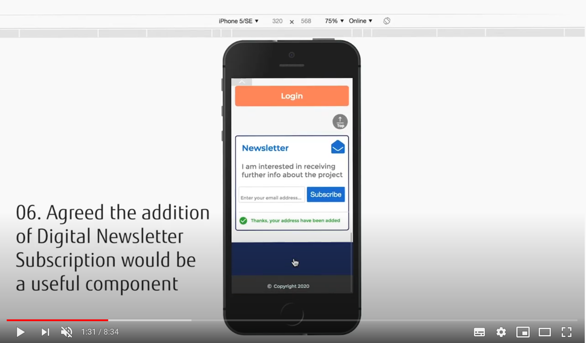 

**One word answer:**

**Expanded answer:**

**Any other comments:**

#

**Q7. Do you feel the return to top button (icon with title top) is a useful navigational feature? Is it clear what the buttons function is? Could it be improved?**

**Time Stamp: 1:37 https://youtu.be/IG-Vq8m8ELA?t=1m37s** 

**Image:** 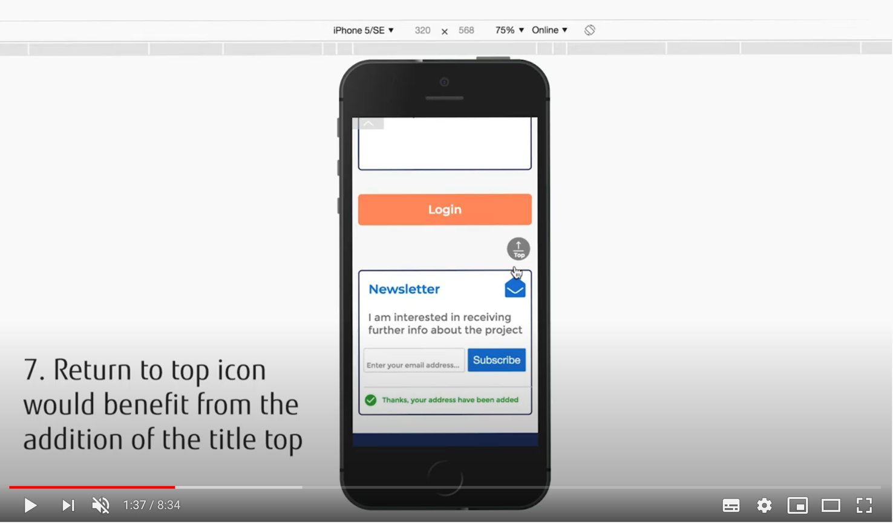 

**One word answer:**

**Expanded answer:**

**Any other comments:**

#

**Q8. Would you agree the safe and secure engagement section should be removed and placed on the about page to make the design cleaner?**
 
**Time Stamp: 1:42 https://youtu.be/IG-Vq8m8ELA?t=1m42s** 

**Image:** 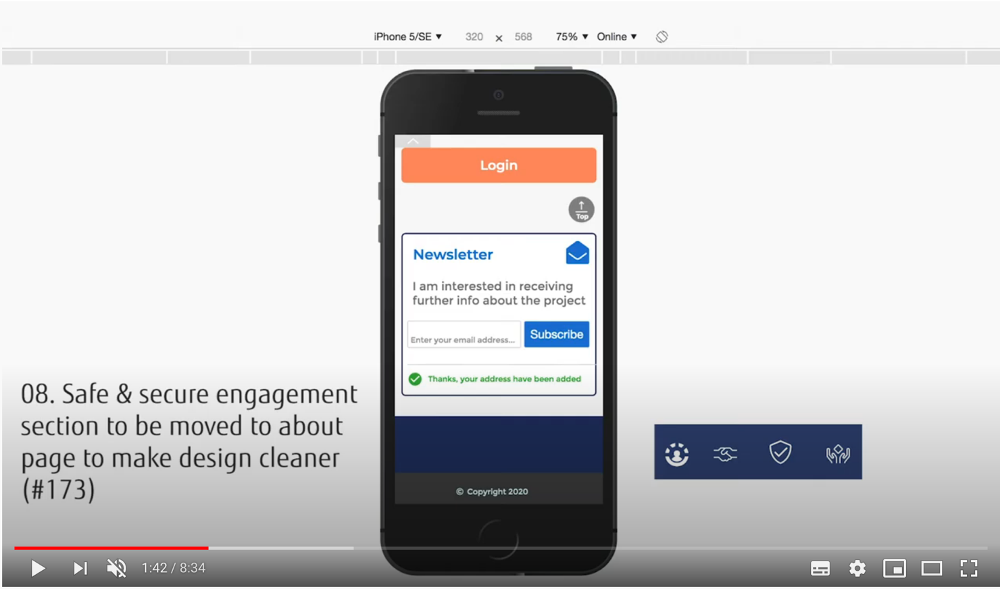 

**One word answer:**

**Expanded answer:**

**Any other comments:**

#

**Q9. It has been suggested that the call to action button - get started / login, be refined to just login? Would you agree with this feedback as shown?**

**Time Stamp: 1:55 https://youtu.be/IG-Vq8m8ELA?t=1m55s** 

**Image:** 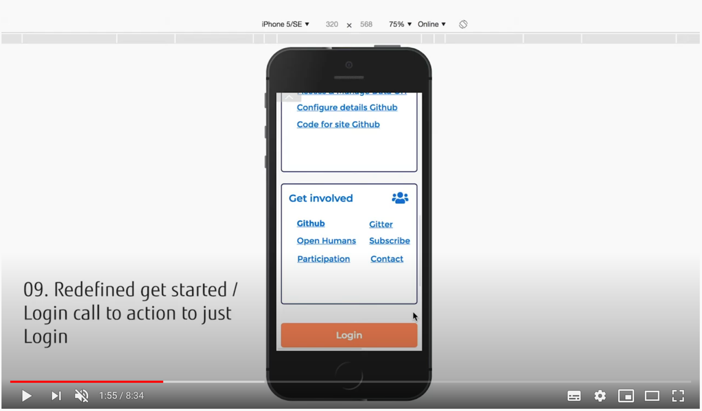 

**One word answer:**

**Expanded answer:**

**Any other comments:**

#

**Q10. It has also been suggested that all other references to other brands i.e. Open Human logos, Github logo etc be removed from the home page, would you agree this will make the home page design more clearer?**
 
**Time Stamp:** 
 
**1:26 https://youtu.be/IG-Vq8m8ELA?t=1m26s  Sprint 3**   
**6:49 https://youtu.be/4f6kn5HLysc?t=6m49s Sprint 1** 

**Image:**  

**One word answer:**

**Expanded answer:**

**Any other comments:**

 
 
#
 
**Q11. It is important to define that the platform is for autistic people. Could, this be defined more clearly in the strap line and within, the platform aims? If so how?**
 
**Timestamp: 2:08 https://youtu.be/IG-Vq8m8ELA?t=2m08s** 
 
**Image:** 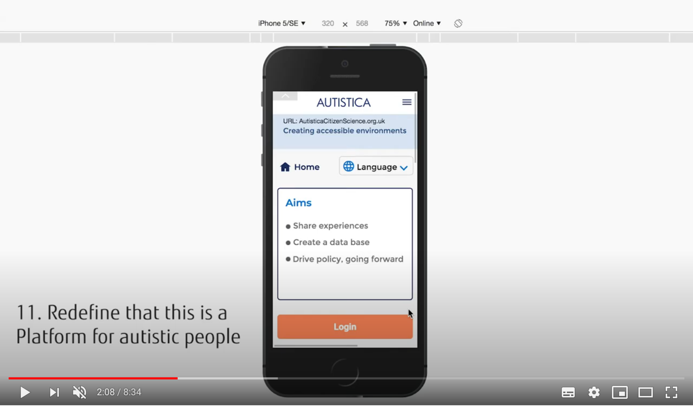 

**One word answer:**

**Expanded answer:**

**Any other comments:**

#

**Q12.  It has been proposed the accessibility / personalization configuration, should be removed from the homepage and make accessible to the user after they have defined there profile, would you agree with this change?**

**It has been, proposed at the point of the user entering there experiences the accessibility / personalisation configurations will be accessible.**
 
**Time Stamp:**
 
**2:10 https://youtu.be/IG-Vq8m8ELA?t=2m10s Sprint 3**  
**4:56 https://youtu.be/4f6kn5HLysc?t=6m49s Sprint 1** 
 
**Image:** 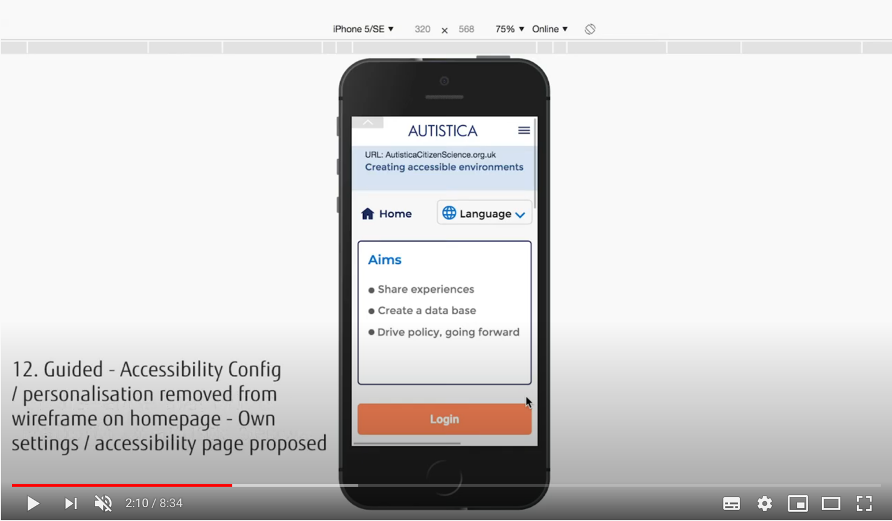 

**One word answer:**

**Expanded answer:**

**Any other comments:**

#

**Dark Theme**
 

**Q13. Feedback was received that more contrast was required to the font colour to lift the text from the contents panels, do you feel this has helped the dark theme?**
 
**Can you make any recommendations on how the Dark Theme could be improved?**
 
**Time Stamps:**
 
**2:37 - 2:46 - across devices**
 
**2:37 - iPhone Device Version Shown https://youtu.be/IG-Vq8m8ELA?t=2m37s** 

**Image:** 

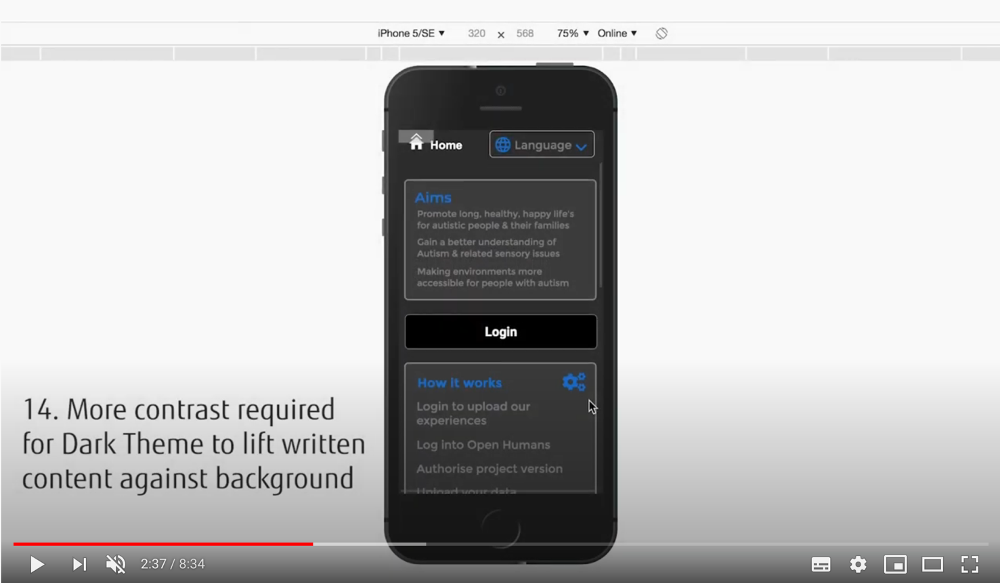 

**One word answer:**

**Expanded answer:**

**Any other comments:**

#

**Q14. Can you make any recommendations on how the design could be improved further across the iPad Portrait and Large Screen wireframes shown?**

**Time Stamps:** 
 
**iPad Portrait 3:04 https://youtu.be/IG-Vq8m8ELA?t=3m04s**
 
**Large Screen 3:13 https://youtu.be/IG-Vq8m8ELA?t=3m13s** 
 
**Images:**
 
 
 
 

**One word answer:**

**Expanded answer:**

**Any other comments:**

#

**User Profile** 
**Q15.1. Do you prefer the design Layout 1 or Layout 2 on iPhone wireframe for the User Profile page?**
**Please explain why?**
 
**Time Stamps:** 
 
**Layout 1 3:57 https://youtu.be/IG-Vq8m8ELA?t=3m57s**
 
**Layout 2 4:06 https://youtu.be/IG-Vq8m8ELA?t=4m06s** 
 
**Images:** 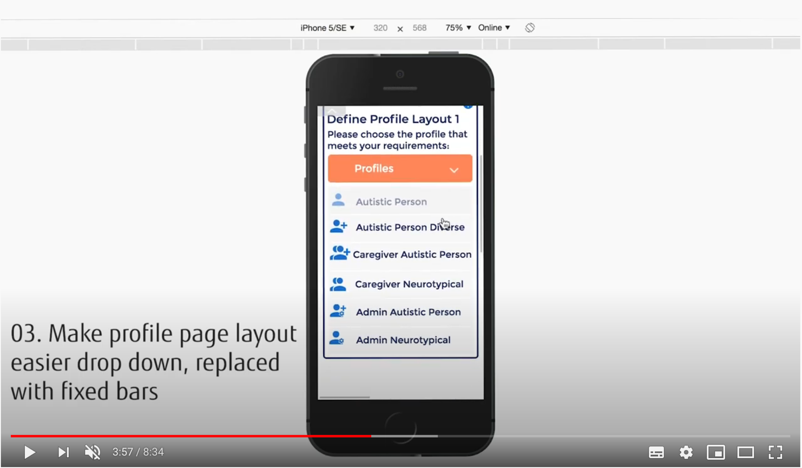 
 
 
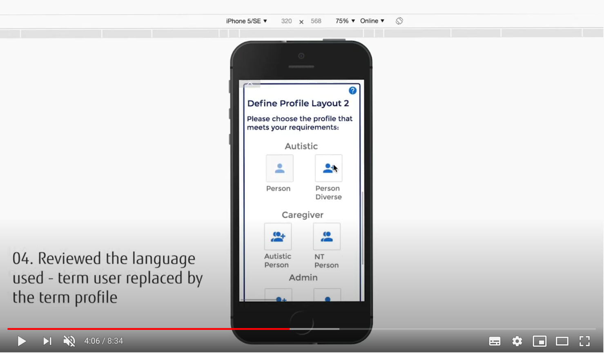 

**One word answer:**

**Expanded answer:**

**Any other comments:**

#

**Q15.2. What unique features would a caregiver account need to have over a standard autistic persons user account on the platform?**

**Time Stamp:** NA 
**Image:** NA

**One word answer:**

**Expanded answer:**

**Any other comments:**

#

**Q16. Do you recognise with the term Autistic Person? Do you recognise the term Neurotypical?**

**Time Stamp: 4:09 https://youtu.be/IG-Vq8m8ELA?t=4m09s** 
 
**Image:** 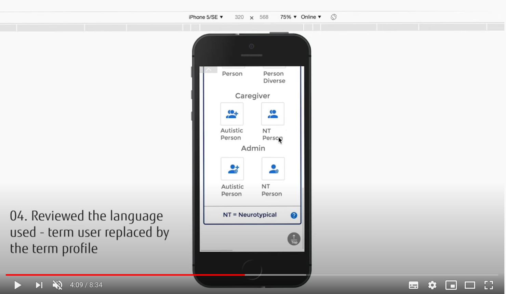 

**One word answer:**

**Expanded answer:**

**Any other comments:**

	
#

**Q17. Within the Define Profile large screen view there are two Stepper designs which design do you prefer? Stepper 1 or Stepper 2?**
 
**(Stepper - element that displays progress by breaking process into a sequence of logical and numbered steps)**

**Time Stamp: 4:24 https://youtu.be/IG-Vq8m8ELA?t=4m24s** 
 
 **Image:** 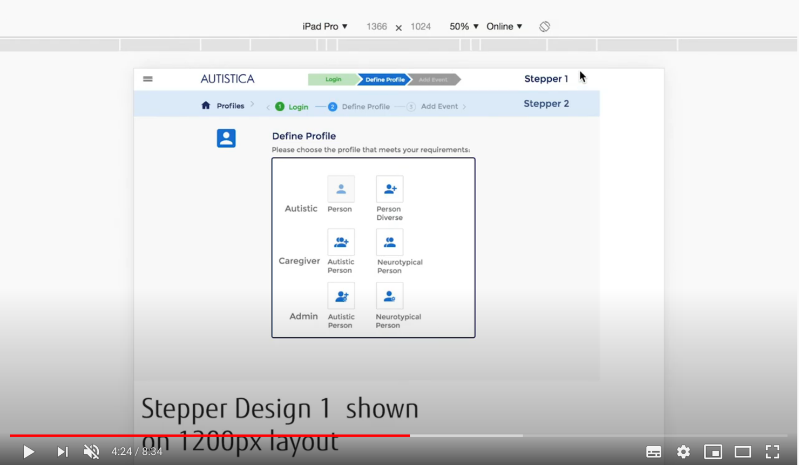 

**One word answer:**

**Expanded answer:**

**Any other comments:**

#

**Experience Page**
 
**Q18. Is it clear what the experience page is asking from the user?**
 
**Time Stamp: 4:59 https://youtu.be/IG-Vq8m8ELA?t=4m59s** 

**Image:** 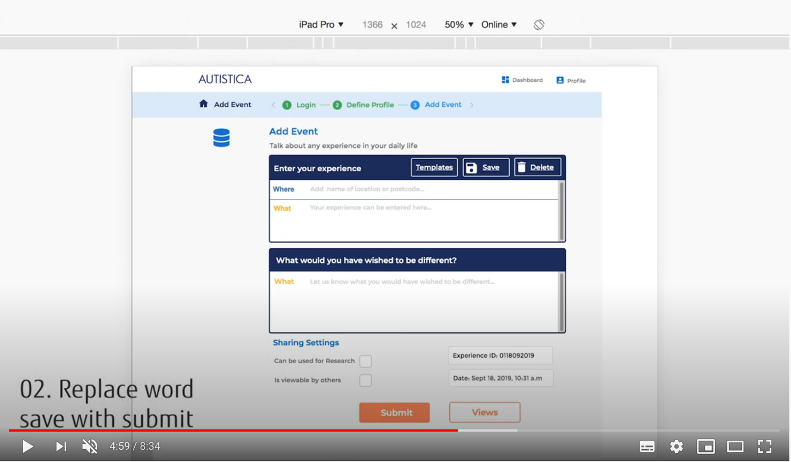 

**One word answer:**

**Expanded answer:**

**Any other comments:**

#

**Q19. Are the terms Where & What ones that you can relate to and use?**
 
**Time Stamp: 4:59 https://youtu.be/IG-Vq8m8ELA?t=4m59s** 

**Image:**  

**One word answer:**

**Expanded answer:**

**Any other comments:**

#
**Experience Submission** 

**Q20. Would the functionality of offline use be desirable - e.g. would, it be beneficial if you could still look at your and other's experiences without internet connection?**

**When submitting an experience, what would you expect to see in the following scenarios?**

**The experience is, submitted to the platform successfully.**

**The experience cannot be submitted to the platform due to a technical issue such as a server problem or internet connection issue.**

**When editing an experience that you may wish to come back to later, would you rather see a save for later button that you have to manually click in order to save a draft or the platform to Autosave the edit with confirmatory text that a draft has been saved.**

**Time Stamp:** NA 
**Image:** NA

**One word answer:**

**Expanded answer:**

**Any other comments:**

#

**Q21. When submitting an experience, what kind of input method is important to you?** 

**Free text field (unrestricted word count), Free text field (restricted word count) - If you like this method how many words would you say is suitable as a restriction?**

**Time Stamp:** NA 
**Image:** NA

**One word answer:**

**Expanded answer:**

**Any other comments:**

#

**Q22. What would be the best way to notify you when an experience is, being used in a piece of research? Directly in the app (If so how), Email, Newsletter, Text, Phone notification, Not interested or other. If other please explain.**

**Time Stamp:** NA 
**Image:** NA

**One word answer:**

**Expanded answer:**

**Any other comments:**

#

**Q23. When you want to view public experiences from others who have shared their experiences on the platform, what would be the easiest method for you to find relevant experiences? e.g. a search box, experiences plotted on a map therefore showing previously submitted experiences nearby, date and time, emotion or other. Please explain the best search mechanism and also, what categories you would like to search against.**

**Time Stamp:** NA 
**Image:** NA

**One word answer:**

**Expanded answer:**

**Any other comments:**

#

**Q24. What would be the best way to share community information with you? Directly in the app (If so how), Email, Newsletter, Text, Phone notification, Not interested or other. If other please explain.**

**Time Stamp:** NA 
**Image:** NA

**One word answer:**

**Expanded answer:**

**Any other comments:**

#

**Q25. If you prefer this method, which structured prompts, would you think are relevant?** 

**Please consider that the aim of capturing your experience is to be able to share what happened to you, how you felt as result of the experience and any suggestions that could have changed or will change the experience for the better.**

**Symbols e.g. Emoji and Widgit**
**Other - Please explain the method you would prefer**

**Time Stamp:** NA 
**Image:** NA

**One word answer:**

**Expanded answer:**

**Any other comments:**

#

**Q26. How would you prefer to be prompted and encouraged by the platform to submit a new experience? e.g. Mobile Text Message, Email, Phone Notification, Not interested or other (If other please explain)**

**Time Stamp:** NA 
**Image:** NA

**One word answer:**

**Expanded answer:**

**Any other comments:**

#

**Q27. If there was, to be a confirmatory sound when you submit a new experience to the platform, what kind of sound would it be? e.g. Bell, Chime, Whoosh, Not interested in a sound or other (If other please explain)**

**Time Stamp:** NA 
**Image:** NA

**One word answer:**

**Expanded answer:**

**Any other comments:**

#

**Q28. If the platform were to provide a feature of showing you locations of nearby relevant sanctuaries/safe, how many sanctuaries should, be shown at once in order to provide you sufficient choice but to not be too overwhelming at the same time? e.g. 1, 5, 10 or other (If other what number)**
 
**If the platform were to provide a feature of showing you locations of nearby sanctuaries/safe spaces, how would you like to see these presented to you? e.g. pins on a map, a list or other. Please detail what you would expect to see.** 

**Time Stamp:** NA 
**Image:** NA

**One word answer:**

**Expanded answer:**

**Any other comments:**

#

**Q29. One of the components for the table view is a view for the experiences. Which are displayed as 12 events / experiences per page. (events displayed per page) Do you feel this number of events / experiences per page is enough, to many or to few?**

**Time Stamp: 6:02 https://youtu.be/IG-Vq8m8ELA?t=6m02s** 

**Image:** 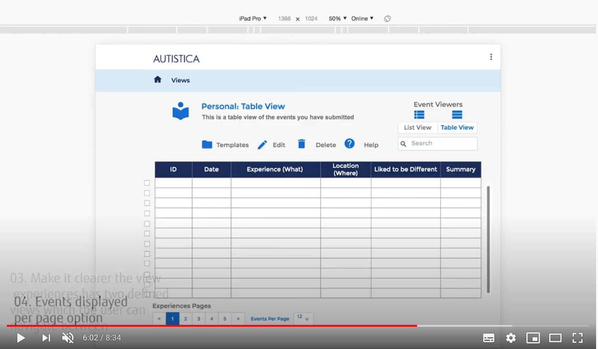 

**One word answer:**

**Expanded answer:**

**Any other comments:**

#

**Q30. We are proposing two methods to view your experiences whose they have been inputted into the experience page. The current proposed views are List View & Table View would you like to see any other type of views to view your experiences?**
 
**Time Stamp: 6:13 https://youtu.be/IG-Vq8m8ELA?t=6m13s** 

**Image:** 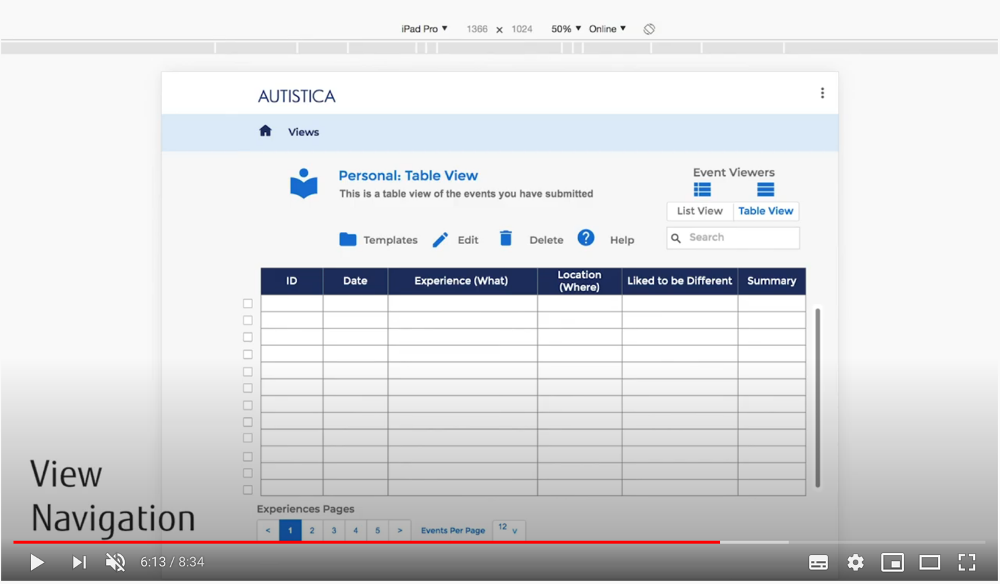 

**One word answer:**

**Expanded answer:**

**Any other comments:**

#

**Q31. Have you got, any feedback for the dashboard page?**
 
**Time Stamp: 6:21 https://youtu.be/IG-Vq8m8ELA?t=6m21s** 

**Image:** 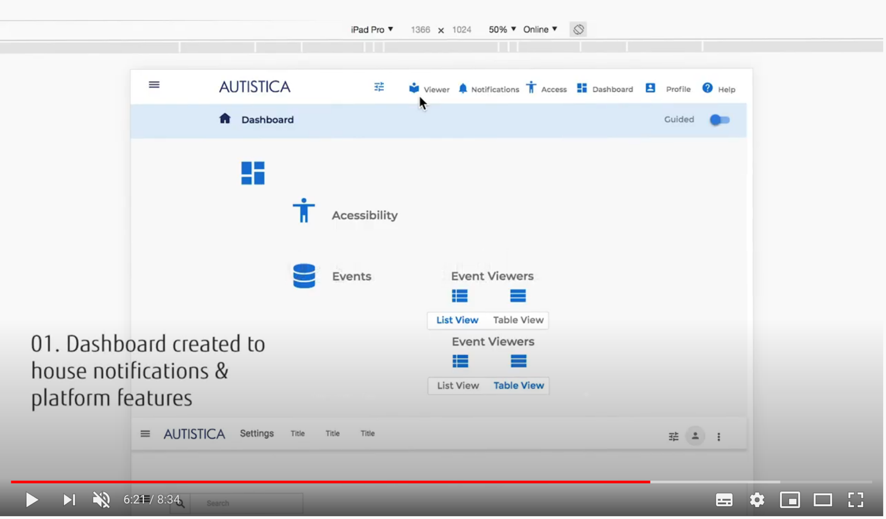 

**One word answer:**

**Expanded answer:**

**Any other comments:**

#

**Q32. We have a number of accessibility features proposed within the platform ranging from a non-verbal communicator, to a screen reader, larger font sizes, high contrast, closed captions and a screen magnifier.**
 
**Would you like to see any others? Do you have a preference to the accessibility features the platform should provide you?**
 
**Time Stamp: 6:34 https://youtu.be/IG-Vq8m8ELA?t=6m34s** 

**Image:** 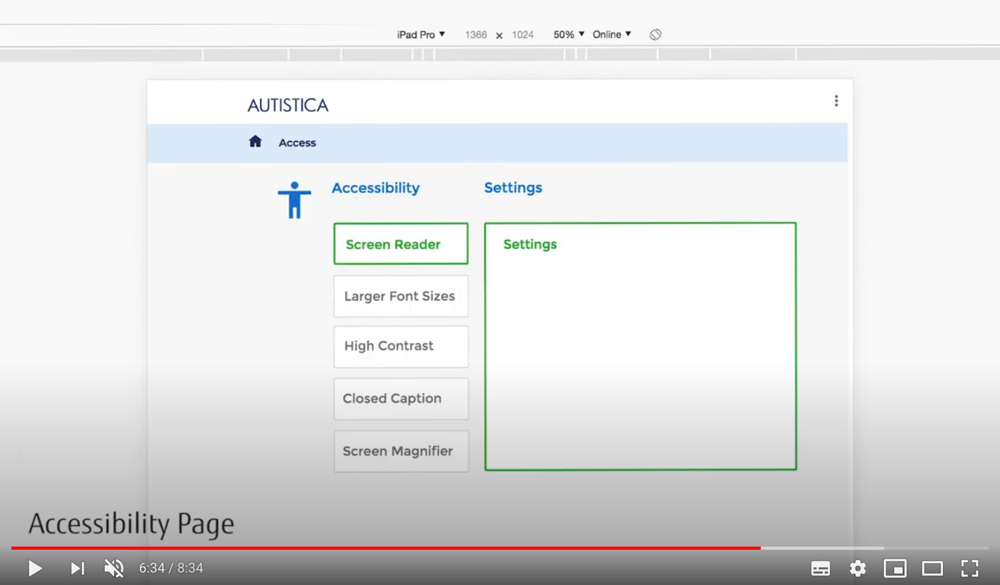 

**One word answer:**

**Expanded answer:**

**Any other comments:**

#

