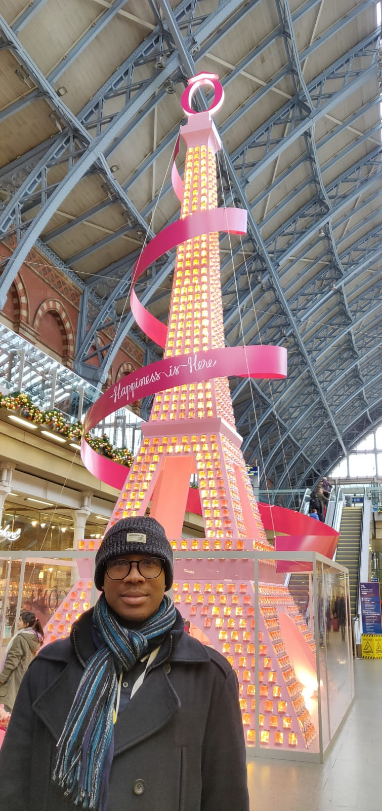

# Newsletter | January 2020

*Date sent: 8 January 2019*

Subject: Happy new year from the Autistica/Turing Citizen Science project

Hello,

Happy New Year!
This is the January 2020 newsletter for the Autistica/Turing Citizen Science project.

## Introducing Community Members

For our 2020 newsletters, we will be introducing a new member of the project community every month, to showcase some of the fantastic work you're doing, and to say thank you to the people supporting us!

If you've helped with the project and would like to be featured in a newsletter, you can get in touch with Georgia by replying to this email or emailing [gaitkenhead@turing.ac.uk](mailto:gaitkenhead@turing.ac.uk).

This week we're delighted to introduce *Otis Smith*, a Facilities Assistant at The Alan Turing Institute, and one of our amazing autistic collaborators.
Otis joined the project in 2019 and has been helping by providing reviews, insights, ideas, and design suggestions. He was interviewed by Georgia.

### Tell us about yourself

I live in South East London.
One of my hobbies is go to libraries or galleries.
Things I dislike are sport or anything contact-related, large crowds, and noise.
My ultimate gift is seeing and making others happy.

### Describe some of your experiences of autism

Since being diagnosed with autism, I have learned various ways to engage and interact with others.
My experience of autism is hit and miss: some days are good, other days not so.
I have always had difficulties even from when I was younger.
I didn’t realise it would compromise so much.
At the same time, it was the push I needed to get on track.

### Why are you helping with the citizen science project?

It was an opportunity that was too good to resist.
I was keen on taking part in the hope of expanding and offering any help possible to improve the lives of autistic people.
I would hope that by my contribution to the project, many people can benefit from it and relate to it more.
It is not like anything I have done before.

### Why is the project important to you?:

The project has an important part to play in more ways than one: to make a difference, to "spread the word", to create something that will have a long-lasting but effective result.
The project is only the start of many great things to come.

### Why should other people get involved?:

Others should be involved because it isn't like anything you've done before.
By joining the project you can gather new ideas or inspiration.
Having more people on board will be a great help.
It will be the turning point that leads to many open doors, not just for today or tomorrow but future generations.

Many thanks to Otis for doing this interview and for all his hard work!

## Co-Creating In-Person

### Focus groups

Once again, thank you to everyone who took part in the focus group sessions.
When we completed the summaries of the sessions and the next step is to send them to the participants to ensure that we have appropriately anonymised their comments.

These summaries are 30 pages long!
Each!
We've been refining how they're organised to make it easier for folks to review and we've created a guide for participants to hopeful make it a little easier to do.
We really appreciate Autistica providing us with funding to reimburse insight group participants for their time reviewing the text.

We will be sending them out in the next couple of weeks.
Thank you for your patience.

### Technical Sprint

We are running our second technical sprint with Fujitsu on 13 January.
This session will be used to work out the process of prioritising the "backlog" of the project (all the technical work which needs to be done), and how we can best involve autistic people and their families.

## Participate

### Diversity

Following on from discussions in our focus groups, we would be really interested to hear from you any ideas about how to reach groups of people who may not have had a chance to hear about the project, or any adjustments we could make for people who may find it difficult to attend an in-person session.

The best way to share your feedback and suggestions is to fill in our online survey: [https://bit.ly/AutisticaTuringCitSciForm](https://bit.ly/AutisticaTuringCitSciForm).
If you find the form confusing or don't want to have your suggestion publicly available (no names will be associated with the information), you can also email Georgia at [gaitkenhead@turing.ac.uk](mailto:gaitkenhead@turing.ac.uk).

Any general feedback relating to the project is also always very welcome!

## Community updates

### Autistica Discover conference

A reminder that Autistica has announced the date of the next Discover conference: [10 July 2020](https://twitter.com/Autistica/status/1197100384659165184?s=20) at the University of Nottingham. We hope to see many of you there.
## Thank you!
We are grateful to you all for your continuing help and support to work towards more enabling environments, and more inclusive research, for autistic people and their families.
With very best wishes for 2020 and beyond,
Kirstie and Georgia
