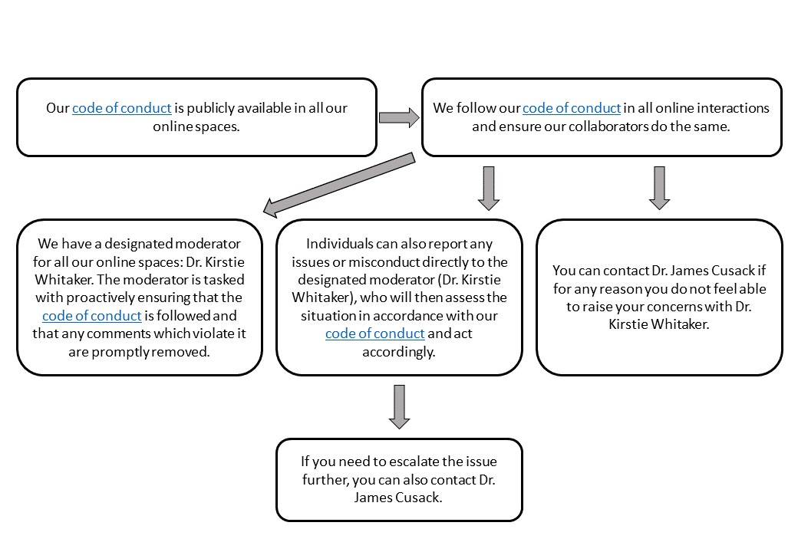

# Information sheet: Building a safe and valued community

_This document outlines how the research team, led by Dr Kirstie Whitaker, will make sure our participants' and contributors' rights and safety are supported as members of the Autistica/Turing Citizen Science community._
_It covers reporting pathways related to our code of conduct, and our process for acknowledging our participants._

## Reporting guidelines for violations of our code of conduct

### In Person

In advance of the session we send participants information covering what to expect during the session, directions to the venue, our [code of conduct](../CODE_OF_CONDUCT.md), our [data management policy](data-management.md) and how to report problems or challenges on the day.
On arrival, at the beginning of the session, we review the information and ensure that participants know what to expect and how their data will be collected, processed, and held.
The research team then seek the participants' written informed consent.
Participants are reminded of their right to withdraw at any point without being required to give a justification.

If participants have an issue they would like to raise or if they would like to report the misconduct of another participant, they can speak privately to one of the facilitators present.
There are always at least two facilitators in each session.

If they have an issue to raise or would like to report misconduct, but do not feel comfortable speaking to the facilitators, or if the problem is with a member of staff, participants can contact Autistica's Director of Science (Dr James Cusack) directly at [james.cusack@autistica.org.uk](mailto:james.cusack@autistica.org.uk).

The individual contacted will act immediately to ensure the participant's safety and will make every effort to address non-urgent concerns promptly, in accordance with our [code of conduct](../CODE_OF_CONDUCT.md).
If necessary, the contacted individual will reach out to the appropriate authorities or emergency services.

If participants do not believe that the concerns they have raised are being dealt with appropriately, they can contact Dr James Cusack directly to escalate the issue.

*Figure 1: Reporting pathway for code of conduct violations at an in person event*

### Online

Our [code of conduct](../CODE_OF_CONDUCT.md) is publicly available at all our online spaces.
We follow our code of conduct in all online interactions and require our collaborators to do the same.

We have a designated moderator for our online environments, Dr Kirstie Whitaker who is responsible for ensuring that the [code of conduct](../CODE_OF_CONDUCT.md) is followed and that any comments which contravene it are promptly removed.
Individuals can also report any issues or misconduct directly to the designated moderator who will assess the situation in accordance with our [code of conduct](../CODE_OF_CONDUCT.md) and act accordingly.

Participants can contact Dr James Cusack, Autistica's Director of Science, directly if for any reason they do not feel able to raise their concerns with Dr Kirstie Whitaker.
If they have already contacted Dr Kirstie Whitaker but feel the need to escalate the issue further, they can also contact Dr James Cusack directly.

*Figure 2: Reporting pathway for code of conduct violations online*

## Process for acknowledging contributors

We understand that for some participants, anonymity and the protection of their data is of paramount importance, while others may prefer public acknowledgement for their contributions and would like to be identified.

There is a publicly available file on our GitHub page – [contributors.md](../contributors.md) – which lists contributors along with how they have contributed.
To protect the privacy of contributors who would prefer to remain anonymous, community members will not be acknowledged automatically.
Contributors may contact researcher team members to request to have their name added to this file.
The names listed will not be linked to any specific contribution or piece of information provided during the study.
Contributors may be acknowledged as a pseudonym.
They are not required to use their full name.

Contributors are welcome to independently write or blog about their experiences.
This provides a mechanism for members to choose to be credited for specific contributions.
A link to the writing can be added to the publicly accessible GitHub project page so long as the content conforms to our values and follows our [code of conduct](../CODE_OF_CONDUCT.md).
A member of the research team will review requests to add these links on a case by case basis.

## Contact Information

Autistica and The Alan Turing Institute have an appointed individual who is responsible for moderating online environments.
The Designated Person for moderating online environments is:

* Dr Kirstie Whitaker, Research Fellow, Alan Turing Institute.
* Email: [kwhitaker@turing.ac.uk](mailto:kwhitaker@turing.ac.uk)

Autistica and The Alan Turing Institute have a Designated Person who can be contacted in order to report misconduct or raise or escalate issues.
This is the person who is in the role of Director of Science at Autistica.
The current Designated Person is:

* Dr James Cusack, Director of Science, Autistica,
* Email: [James.Cusack@autistica.org.uk](mailto:James.Cusack@autistica.org.uk)
