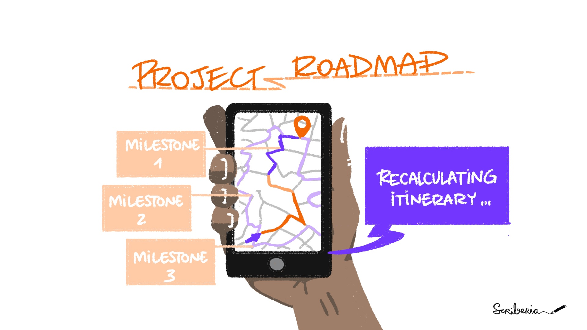

# Project Roadmap

You will find in this folder the Roadmap for the AutSPACEs Project. 

We have different versions of this to ensure inclusivity:
  - [Markdown Version](roadmap.md)
  - [Google Doc Version](https://docs.google.com/document/d/1M-HabZ99V6OB9Z3hVpcE1YzQF6bod-qFK-fca1dTGc8/edit?usp=sharing)

If you believe anything needs to be added or updated in relation to the roadmap, please edit the markdwon folder and create a pull request. 
Please add lottycoupat as the reviewer.  

The journey that was taken to create our roadmap follows the roadmapping chapter in the [Turing Way book](https://the-turing-way.netlify.app/project-design/project-repo/project-repo-roadmapping.html?highlight=roadmapping). 

