Autistica CSP User Interface Design: Planning Feb 20
 
Task 1: Define the purpose of a User Interface - Core Sections

Task 2: Initial User Interface Research:
   
    Autistica Main Website 
    Open Humans
    Molehill Mountain Autistica App
    Project Demo 

Task 3: Initial UI Theme based on UI Research which considers inclusive design

Task 4: Accessibility - Designing for Autism - Mind Map & Supporting Materials feeding into Wireframe Designs - Font, Colours, Framing

Task 5: User Interface Components - Wireframe Designs & Code

UI is the “face” of the project and plays a vital part for its success. 

UI defines the user experience. Good user experience can make people like the tool, while inadequate user experience can make people dislike and abandon the tool despite its benefits.

Task 1: Define the purpose of a User Interface - Core Sections

UI is the “face” of the project and plays a vital part for its success. 

UI defines the user experience. Good user experience can make people like the tool, while inadequate user experience can make people dislike and abandon the tool despite its benefits.

Image 1 

**Image**

Task 2: Related Initial User Interface Research: Autistica Main Website
Image 2
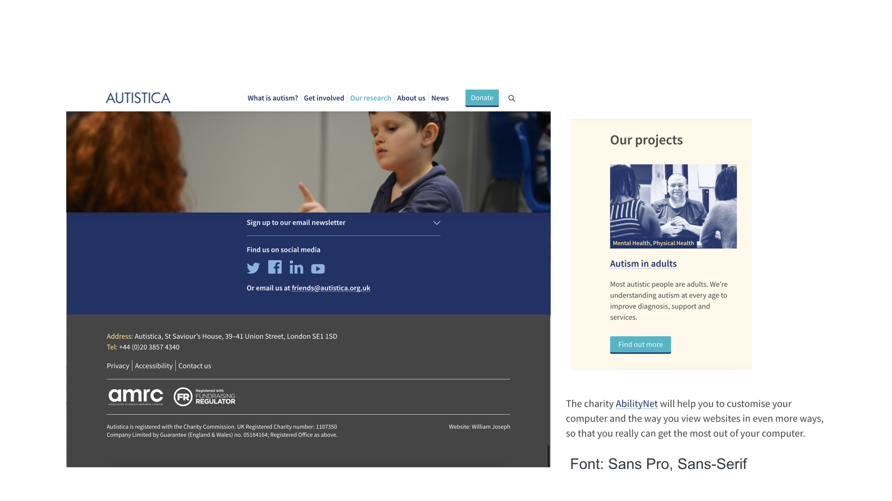

Task 2: Autistica Main Website User Interface Component Research
Image 3
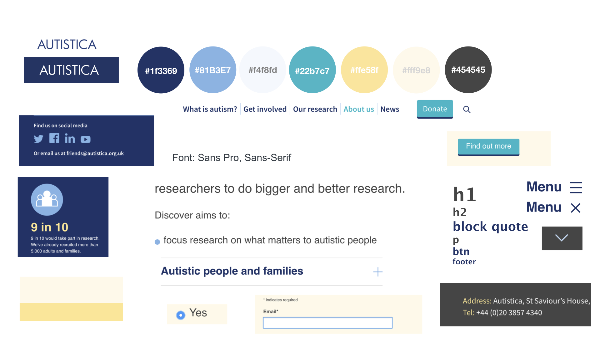

Task 2: Open Humans & Molehill Mountain User Interface Component Research
Image 4
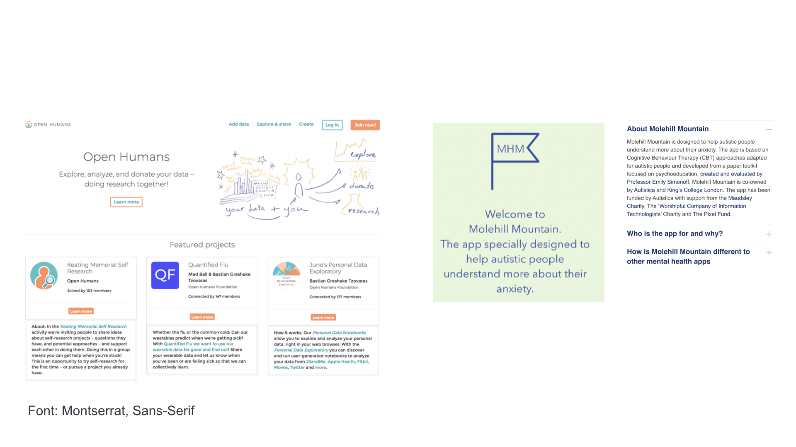

Task 2: Open Humans User Interface Component Research

To create an account the user has to first access the home page of the Open Humans platform then create an open humans login. Given this user journey it is  important to create some subtle component relationship between the platforms - home page and open humans login - this has been achieved through the use of orange Call To Action, font Montserrat, and use of a similar neutral grey background colour which is easy on the eye and calming.

These elements help create a visual connection between this interaction, adds clarity and creates a more seamless interaction for the user. This is one of the other reasons the font Montserrat has been proposed for the platform, coupled with its excellent level of accessibility.

Task 2: Look & Feel Across Initial Demo & Open Humans Login Page

Image 5
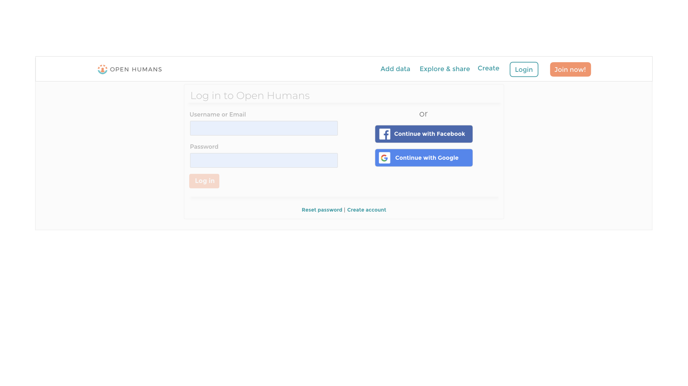

Task 2: Review of Initial Coded Prototype Demo Home Page

Image 6
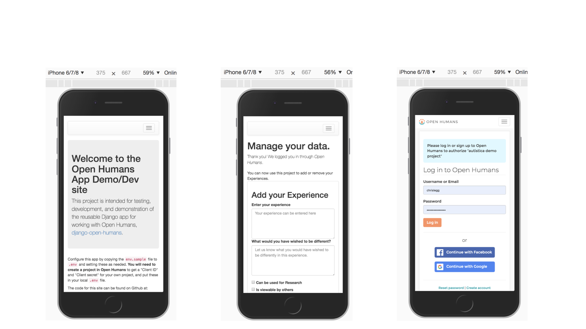

Task 2: Review of Initial Coded Prototype Demo Home Page

Image 7
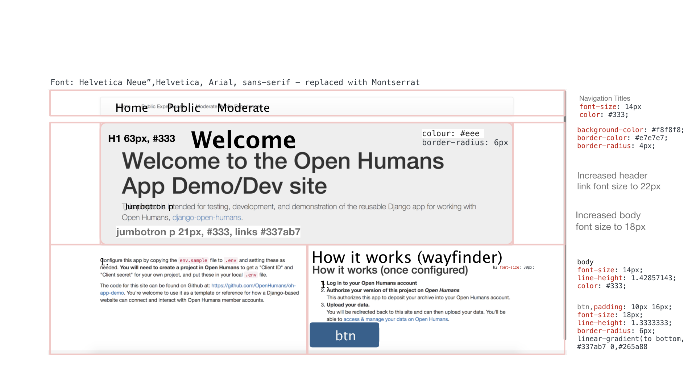

Task 3: Initial UI Theme based on UI Research which considers inclusive design

Image 8
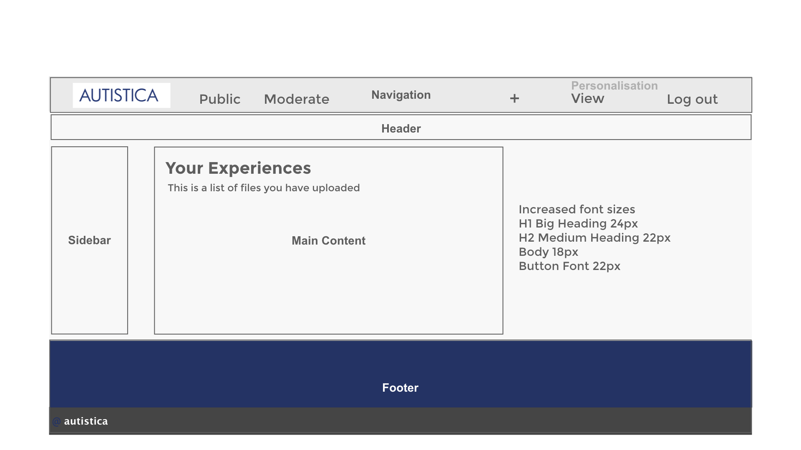

Task 4: Accessibility - Designing for Autism - UI Mapping - Design Considerations Feeding into Wireframe Designs

Image 9
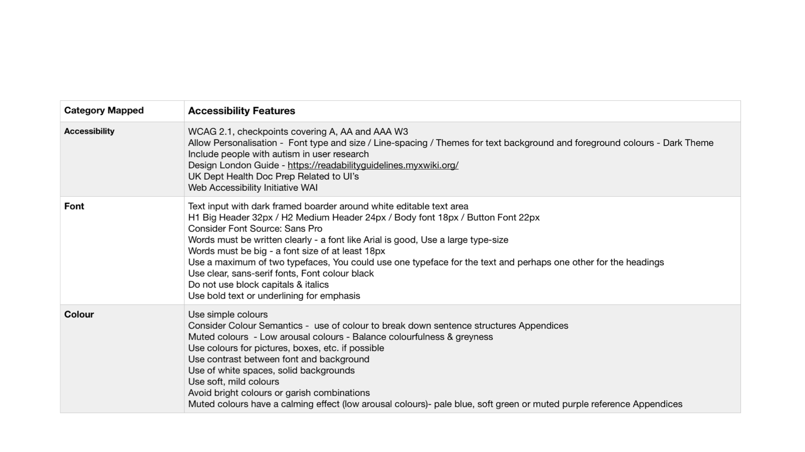
Image 10
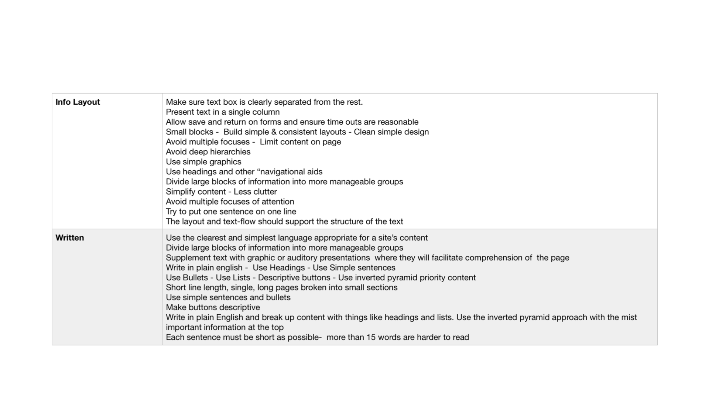
Image 11
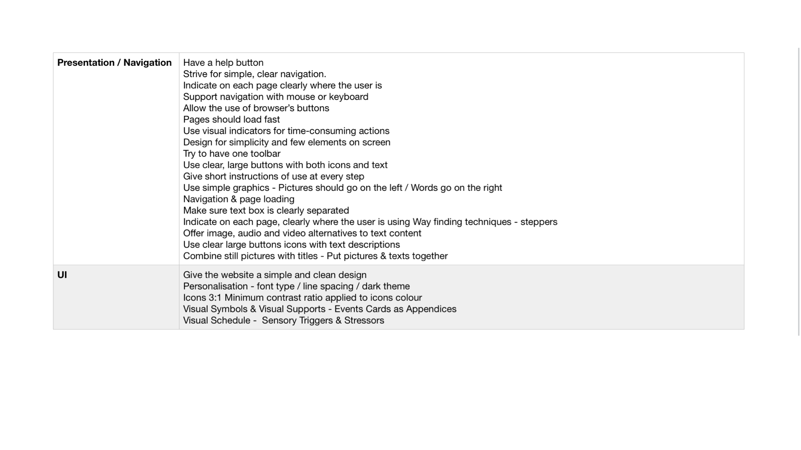

Accessibility - Designing for Autism - Mind Map / 
Core UI Accessibility findings defined from researched sources in appendices
UK Department of Health methodology for the preparation of documents for people with learning disabilities & its Application to UI Design Rules 
UI Design Recommendations for People with ASD, adapted from Government Digital Services GDS
UI Design Recommendations for People with Autism Spectrum Disorder - Linked to Full WCAG 1.0 Checklist https://www.w3.org/WAI/intro/wcag10docs.php / https://www.w3.org/TR/WAI-WEBCONTENT/full-checklist.html

UI Style Guide

Font: 
Montserrat

Font Sizes: 
H1 Big Heading 32px
H2 Medium Heading 24px
Body 18px (large body font size)
Button Title Font 22px

Colour Semantics applied to break down sentence structures on add event page - Where & What (Use of Blue & Orange)

The use of bright blue #1970CC on headers and for icons as ideal as it retains its colour contrast ratio on both white and dark backgrounds reference dark theme and results from Colour Contrast Analyser Tool appendices.

Background colour #F8F8F8, #FFF

Headers and use of icon fill colour #1970CC have a contrast ratio of 4.96:1 and meet WCAG AA standards across all categories, normal text, large text and graphical objects & UI components

Image 12
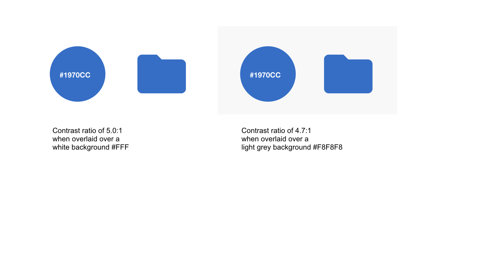

Fonts

Font Considerations

Extensive research indicates that good examples of rounded sans serif fonts which have enough space between letters make appropriate accessible fonts, these font types include:

Arial: Sans-serif typeface 
Helvetica or Neue Haas Grotesk is a widely used sans-serif typeface, Neo-grotesque or realist design
Tahoma - humanist sans-serif typeface
Trebuchet MS - humanist sans-serif typeface
Montserrat - sans-serif typeface
Newer options Benton Sans & Source Sans Pro

Image 13
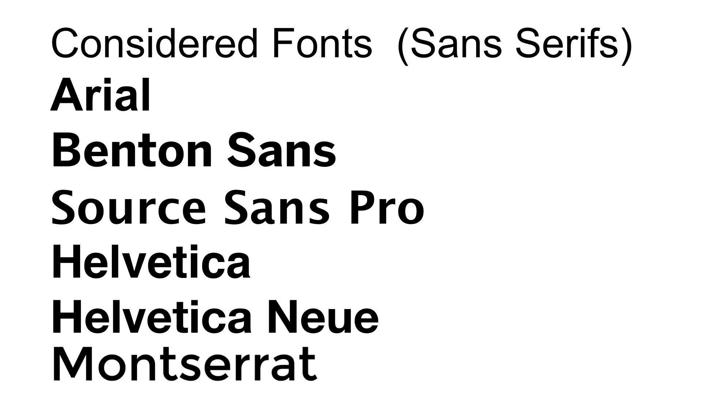

Colour

Ref: Brain In Hand UI & CSP Proposed Color Schemes 

Image 14
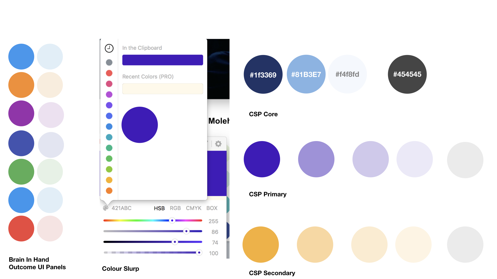

Components

Image 15
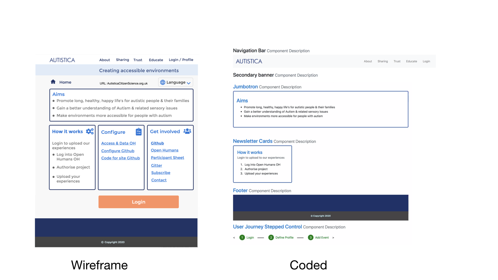

Appendices

Accessibility Sources, Mind Map, UI Design Refs, Open Book UI Case Study, Visual Supports, Visual Symbols, Event Cards

Colours - Visual: Colour Coding, Colour Schemes, Contrast Analyser

Task 4: Accessibility - Designing for Autism - Mind Map

Image 16

UK Department of Health methodology for the preparation of documents for people with learning disabilities & Application UI Design Rules 

•  Rule 1: Each idea needs both words and pictures - both pictures & words are important
•  Rule 2: Pictures & words go next to each other - this helps more people to understand the information
•  Rule 3: Make sure that it is clear which pictures support which bits of text
•  Rule 4: Pictures must be easy to understand
•  Rule 5: Pictures should go on the left
•  Rule 6: Pictures can be drawings, photographs or other images.
•  Rule 7: Make sure that pictures are as big as possible
•  Rule 8: Words must be easy to understand
•  Rule 9: If you use difficult words, say what they mean using easy words
•  Rule 10: Words go on the right
•  Rule 11: Words must be written clearly - a font like Arial is good
•  Rule 12: Words must be big - a font size of at least 14 point is good - 19px
•  Rule 13: Each sentence must be short as possible-  more than 15 words are harder to read.

UI Design Recommendations for People with Autism Spectrum Disorder ASD Paper 

UI design recommendations follow the guidelines set forth by the World Wide Web Consortium (W3C) through the Web Accessibility Initiative (WAI) to improve web access to people with disabilities by means of the concept of “inclusive design”. These recommendations aim to improve accessibility (which develops the efficacy of the tool) and usability (which increases its efficiency) and establish the ideal interaction and interdependence between the different components of the web development (i.e. content, web browser, assistive technology, user, developer, authoring tools and evaluation tools).

The findings described in this paper enable us define the following requirements for UI for people with ASD:

Avoid deep hierarchies
Reduce memory load
Avoid multiple focuses of attention
WCAG 2.1: 118 checkpoints covering A, AA and AAA W3 accessibility guidelines
Disabilities like ADHD and Autism can cause difficulty in handling impressions, sorting information and sensitivity to sound
Give the website a simple and clean design
Be careful with animations and strong colours
Avoid having too much content on the same page
Offer image, audio and video alternatives to text content

The report defines additional recommendations on layout with an application to UI Design for people with ASD as:

Never use a picture as background for the text, his can make reading the text very difficult
Try to put one sentence on one line
If this is not possible, try to have separate clauses on separate lines or break the sentence into separate lines at the points where people would naturally pause
Keep sentences together on one page
Do not fill your page with too much information
The layout and text-flow should support the structure of the text
If the text introduces a new idea, consider beginning a new page
The text should flow logically and not leapfrog across the page or be continued several pages later
Use a maximum of two typefaces
You could use one typeface for the text and perhaps one other for the headings
Use a large type-size 
Be careful about how you emphasis text
Do not use block capitals and italics in the text
Use bold text or underlining for emphasis
Use colours for pictures, boxes, etc. if possible
Use headings and other “navigational aids
For dates use the full format “Saturday, 26 September 1998”
Always use the numeral and not the equivalent word - even for numbers below 10 For example 3, 67, 239
Never use roman numerals
Do not justify the text on the right hand side, ragged right edge makes a column of text easier to read
Do not hyphenate long words at the right margin of the text

UI Design Recommendations for People with ASD adapted from Government Digital Services

Presentation

Do:
• Use contrast between font and background.
• Use soft, mild colours.
• Make sure text box is clearly separated from the rest.
• Present text in a single column.
• Use simple graphics.
• Use clear, sans-serif fonts.

Do not:
• Do not use bright colours.
• Do not user background images.
• Do not overlap transparent images and text.
• Do not use pop-up elements and distractions.
• No element should stand out too much.
• Do not have horizontal scrolling.

Navigation & Page Loading 

Do:
 • Strive for simple, clear navigation.
 • Indicate on each page clearly where the user is.
 • Support navigation with mouse or keyboard.
 • Allow the use of browser’s buttons.
 • Pages should load fast.
 • Use visual indicators for time-consuming actions.
 • Have a Help button.

Do not:
 • Use complex menus.

Interaction

Do:
 • Design for simplicity and few elements on screen.
 • Try to have one toolbar.
 • Use clear, large buttons with both icons and text.
 • Give short instructions of use at every step
Do not:
 • Avoid cluttered interface.
 • Do not use many-colored icons.
 • Avoid buttons with icons only, except for the most popular actions. For example, “back”.

Allow personalisation of:

 • Font type and size
 • Line-spacing
 • Themes for text background and foreground colours

UI Design Recommendations for People with ASD Government Digital Services 

Image 17
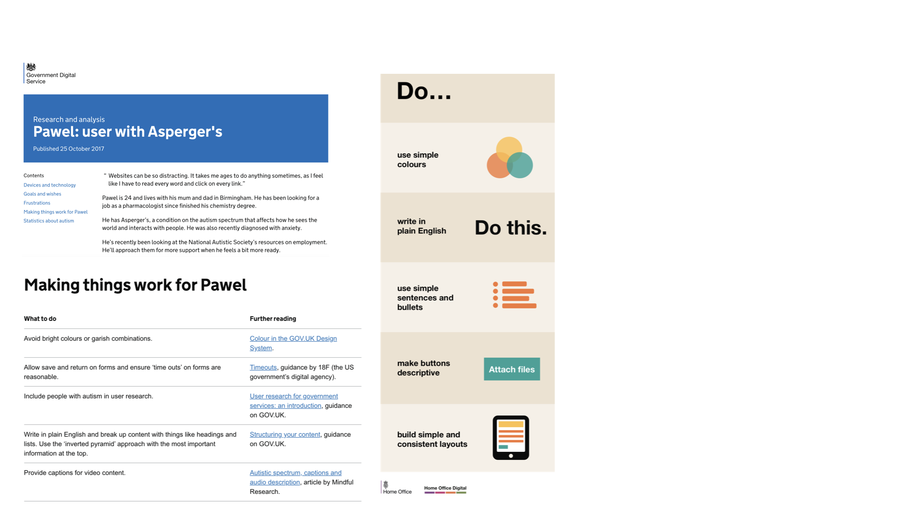

UI Design Recommendations for People with Autism Spectrum Disorder - Linked to Full WCAG 1.0 Checklist https://www.w3.org/WAI/intro/wcag10docs.php / https://www.w3.org/TR/WAI-WEBCONTENT/full-checklist.html

Images 

Autistic learners are visual 

Colours have powerful influence enhancing memory performance with them designing multimedia interfaces. Autistics are very sensitive to certain colours they respond highly to colours such as (blue, dark yellow and green) these colours have a positive effect and motivate them.

The use of natural colours also help autistics with their lives in general  - social interaction and decoding situations.  Kids with autism thrive in calm and relaxing settings where they can decompress. Both boys and girls respond well to pale pink or other tranquil hues, such as pale blue, soft green or muted purple. 

Muted colours have a calming effect upon children with autism. Pale pink has been demonstrated through tests to be their favourite colour overall. Cool colours such as blue and green are also soothing. Adele,(2014) 

Images 18 - 28

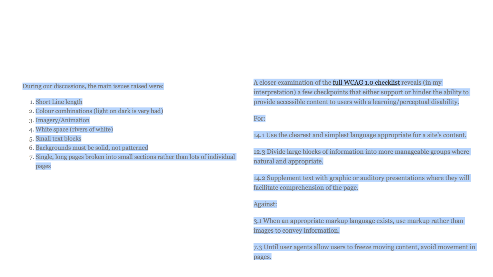
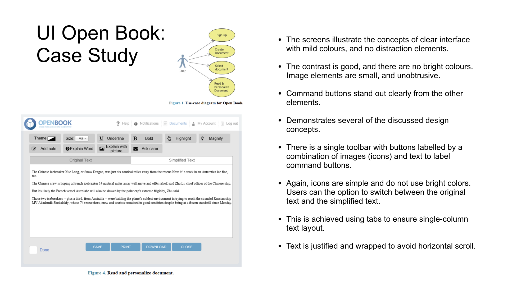
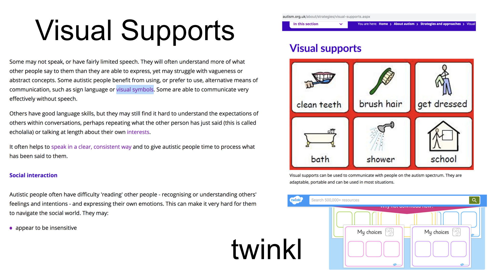
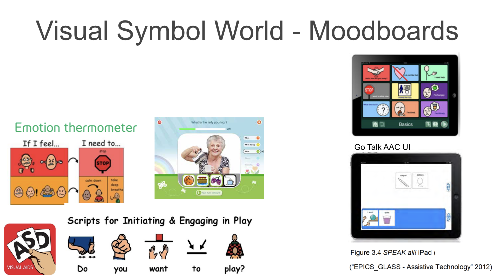
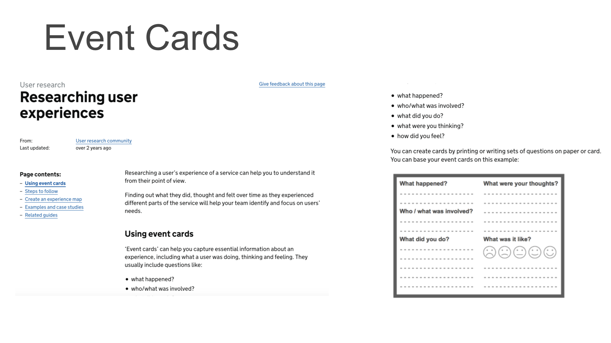
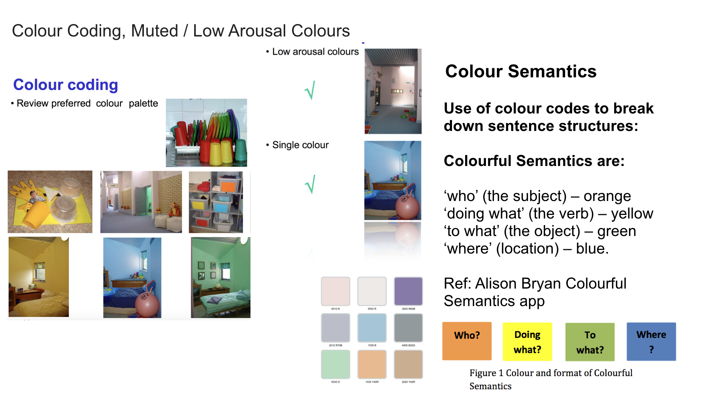
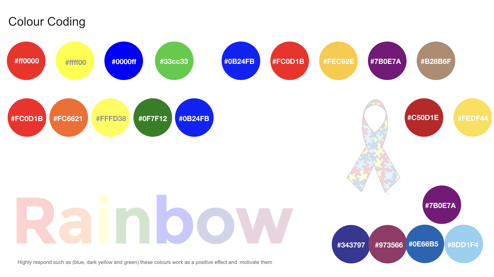
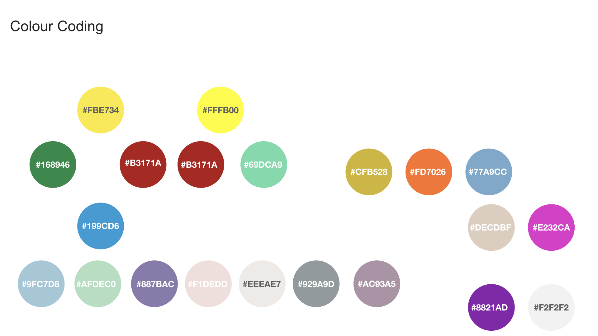
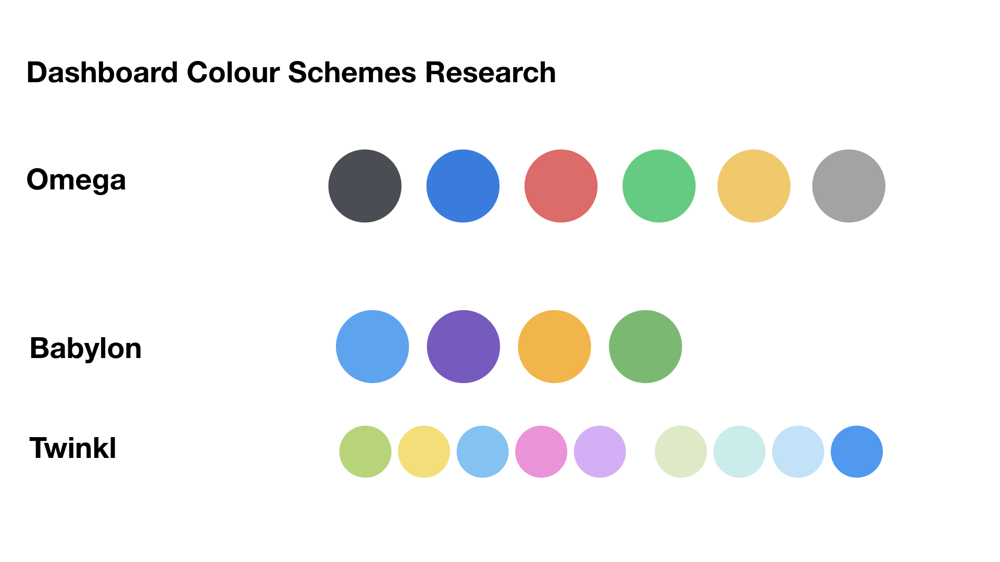
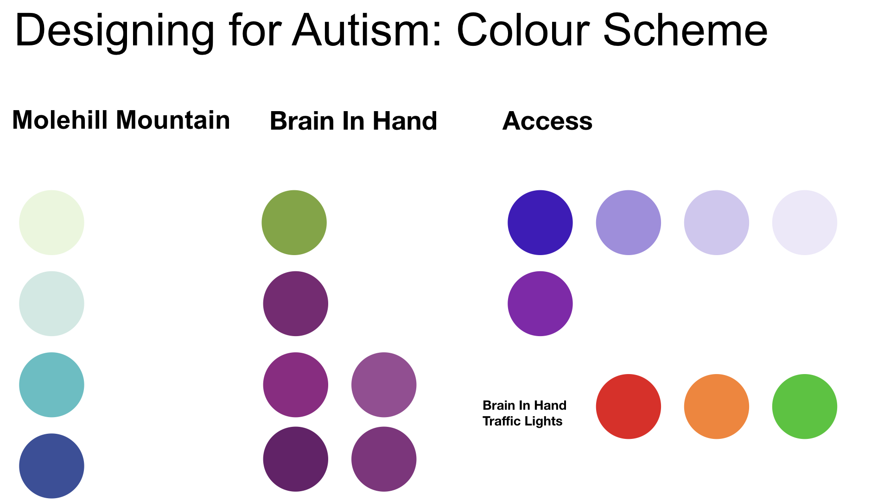
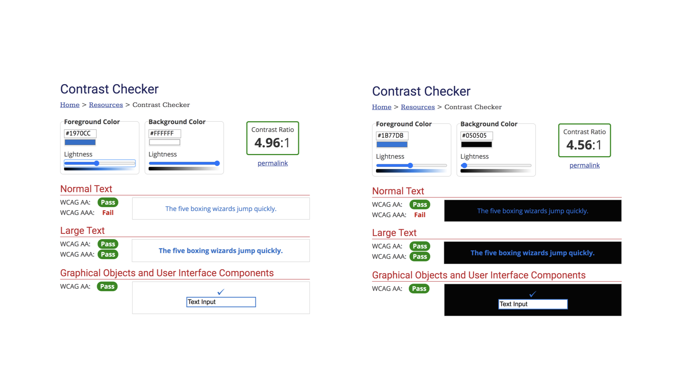
